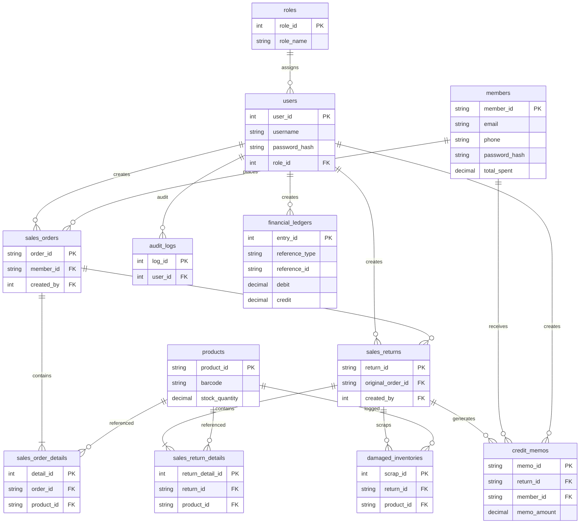

# 進銷存與權限管理系統 (Invoicing, Inventory & RBAC System) 技術實施計畫

---

## 一、 實體資料庫設計 (Database Schema & DDL Specification)

本專案採用 **MySQL 8.0** 資料庫。為確保底層數據的強健性與一致性，我們不單只在後端應用層（Express）做檢查，更在資料庫層強制加上 **外鍵約束 (Foreign Key Constraints)**、**級聯操作限制 (Cascades)**、**唯一性索引 (Unique Indexes)** 以及 **數值校驗限制 (Check Constraints)**。

本系統實施「雙軌帳號管理」，後台員工由 `users` 資料表管理，前台客戶/會員由 `members` 資料表管理，兩者具備完全隔離的實體結構與驗證鏈。

以下為生產級 MySQL 8.0 DDL 實體建表腳本草案，此腳本將作為 `./init-db/schema.sql` 供 Docker 容器初始化使用：

```sql
-- 建立資料庫
CREATE DATABASE IF NOT EXISTS `erp_system` DEFAULT CHARACTER SET utf8mb4 COLLATE utf8mb4_unicode_ci;
USE `erp_system`;

-- 1. roles (角色資料表)
CREATE TABLE `roles` (
  `role_id` INT AUTO_INCREMENT,
  `role_name` VARCHAR(50) NOT NULL,
  `description` VARCHAR(255) NULL,
  PRIMARY KEY (`role_id`),
  UNIQUE KEY `idx_roles_name` (`role_name`)
) ENGINE=InnoDB DEFAULT CHARSET=utf8mb4 COLLATE=utf8mb4_unicode_ci;

-- 2. users (後台員工資料表)
CREATE TABLE `users` (
  `user_id` INT AUTO_INCREMENT,
  `username` VARCHAR(50) NOT NULL,
  `password_hash` VARCHAR(255) NOT NULL,
  `real_name` VARCHAR(100) NOT NULL,
  `role_id` INT NOT NULL,
  `is_active` TINYINT(1) DEFAULT 1,
  `created_at` TIMESTAMP DEFAULT CURRENT_TIMESTAMP,
  PRIMARY KEY (`user_id`),
  UNIQUE KEY `idx_users_username` (`username`),
  CONSTRAINT `fk_users_role` FOREIGN KEY (`role_id`) REFERENCES `roles` (`role_id`) ON DELETE RESTRICT
) ENGINE=InnoDB DEFAULT CHARSET=utf8mb4 COLLATE=utf8mb4_unicode_ci;

-- 3. members (前台會員/客戶主檔表) - 全新加入
CREATE TABLE `members` (
  `member_id` VARCHAR(50) NOT NULL,
  `email` VARCHAR(100) NOT NULL,
  `phone` VARCHAR(20) NOT NULL,
  `password_hash` VARCHAR(255) NOT NULL,
  `real_name` VARCHAR(100) NOT NULL,
  `tier` VARCHAR(20) NOT NULL DEFAULT 'BRONZE', -- BRONZE, SILVER, GOLD, PLATINUM
  `total_spent` DECIMAL(12, 2) NOT NULL DEFAULT 0.00, -- ??????
  `is_active` TINYINT(1) DEFAULT 1,
  `created_at` TIMESTAMP DEFAULT CURRENT_TIMESTAMP,
  PRIMARY KEY (`member_id`),
  UNIQUE KEY `idx_members_email_uniq` (`email`),
  UNIQUE KEY `idx_members_phone_uniq` (`phone`),
  CONSTRAINT `chk_members_tier` CHECK (`tier` IN ('BRONZE', 'SILVER', 'GOLD', 'PLATINUM')),
  CONSTRAINT `chk_members_total_spent` CHECK (`total_spent` >= 0.00)
) ENGINE=InnoDB DEFAULT CHARSET=utf8mb4 COLLATE=utf8mb4_unicode_ci;

-- 4. products (商品主檔表)
CREATE TABLE `products` (
  `product_id` VARCHAR(50) NOT NULL,
  `barcode` VARCHAR(50) NOT NULL,
  `product_name` VARCHAR(255) NOT NULL,
  `spec` VARCHAR(255) NULL,
  `unit` VARCHAR(20) NOT NULL DEFAULT 'pcs',
  `cost_price` DECIMAL(12, 2) NOT NULL,
  `retail_price` DECIMAL(12, 2) NOT NULL,
  `stock_quantity` DECIMAL(12, 2) NOT NULL DEFAULT 0.00,
  `safety_stock` DECIMAL(12, 2) NOT NULL DEFAULT 10.00,
  `created_at` TIMESTAMP DEFAULT CURRENT_TIMESTAMP,
  PRIMARY KEY (`product_id`),
  UNIQUE KEY `idx_products_barcode` (`barcode`),
  CONSTRAINT `chk_cost_price` CHECK (`cost_price` >= 0.00),
  CONSTRAINT `chk_retail_price` CHECK (`retail_price` >= `cost_price`),
  CONSTRAINT `chk_stock_qty` CHECK (`stock_quantity` >= 0.00),
  CONSTRAINT `chk_safety_stock` CHECK (`safety_stock` >= 0.00)
) ENGINE=InnoDB DEFAULT CHARSET=utf8mb4 COLLATE=utf8mb4_unicode_ci;

-- 5. sales_orders (銷售訂單主表) - 修改： customer_name 改為外鍵強關聯 member_id
CREATE TABLE `sales_orders` (
  `order_id` VARCHAR(50) NOT NULL,
  `order_date` DATE NOT NULL,
  `member_id` VARCHAR(50) NOT NULL, -- 關聯會員 ID
  `total_amount` DECIMAL(12, 2) NOT NULL DEFAULT 0.00,
  `status` VARCHAR(20) NOT NULL DEFAULT 'DRAFT', -- DRAFT, APPROVED, SHIPPED, VOIDED
  `created_by` INT NOT NULL,
  `approved_by` INT NULL,
  `created_at` TIMESTAMP DEFAULT CURRENT_TIMESTAMP,
  `updated_at` TIMESTAMP DEFAULT CURRENT_TIMESTAMP ON UPDATE CURRENT_TIMESTAMP,
  PRIMARY KEY (`order_id`),
  INDEX `idx_so_date` (`order_date`),
  INDEX `idx_so_status` (`status`),
  CONSTRAINT `fk_so_member` FOREIGN KEY (`member_id`) REFERENCES `members` (`member_id`) ON DELETE RESTRICT,
  CONSTRAINT `fk_so_creator` FOREIGN KEY (`created_by`) REFERENCES `users` (`user_id`) ON DELETE RESTRICT,
  CONSTRAINT `fk_so_approver` FOREIGN KEY (`approved_by`) REFERENCES `users` (`user_id`) ON DELETE RESTRICT,
  CONSTRAINT `chk_so_total` CHECK (`total_amount` >= 0.00)
) ENGINE=InnoDB DEFAULT CHARSET=utf8mb4 COLLATE=utf8mb4_unicode_ci;

-- 6. sales_order_details (銷售訂單明細副表)
CREATE TABLE `sales_order_details` (
  `detail_id` INT AUTO_INCREMENT,
  `order_id` VARCHAR(50) NOT NULL,
  `product_id` VARCHAR(50) NOT NULL,
  `quantity` DECIMAL(12, 2) NOT NULL,
  `unit_price` DECIMAL(12, 2) NOT NULL,
  `subtotal` DECIMAL(12, 2) NOT NULL,
  PRIMARY KEY (`detail_id`),
  UNIQUE KEY `idx_sod_order_prod` (`order_id`, `product_id`),
  CONSTRAINT `fk_sod_order` FOREIGN KEY (`order_id`) REFERENCES `sales_orders` (`order_id`) ON DELETE CASCADE,
  CONSTRAINT `fk_sod_product` FOREIGN KEY (`product_id`) REFERENCES `products` (`product_id`) ON DELETE RESTRICT,
  CONSTRAINT `chk_sod_qty` CHECK (`quantity` > 0.00),
  CONSTRAINT `chk_sod_price` CHECK (`unit_price` >= 0.00),
  CONSTRAINT `chk_sod_subtotal` CHECK (`subtotal` = `quantity` * `unit_price`)
) ENGINE=InnoDB DEFAULT CHARSET=utf8mb4 COLLATE=utf8mb4_unicode_ci;

-- 7. sales_returns (銷售退貨單主表)
CREATE TABLE `sales_returns` (
  `return_id` VARCHAR(50) NOT NULL,
  `return_date` DATE NOT NULL,
  `original_order_id` VARCHAR(50) NOT NULL,
  `refund_total` DECIMAL(12, 2) NOT NULL DEFAULT 0.00,
  `status` VARCHAR(20) NOT NULL DEFAULT 'DRAFT', -- DRAFT, PENDING, APPROVED, REJECTED
  `created_by` INT NOT NULL,
  `approved_by` INT NULL,
  `created_at` TIMESTAMP DEFAULT CURRENT_TIMESTAMP,
  PRIMARY KEY (`return_id`),
  CONSTRAINT `fk_sr_original_so` FOREIGN KEY (`original_order_id`) REFERENCES `sales_orders` (`order_id`) ON DELETE RESTRICT,
  CONSTRAINT `fk_sr_creator` FOREIGN KEY (`created_by`) REFERENCES `users` (`user_id`) ON DELETE RESTRICT,
  CONSTRAINT `fk_sr_approver` FOREIGN KEY (`approved_by`) REFERENCES `users` (`user_id`) ON DELETE RESTRICT,
  CONSTRAINT `chk_sr_refund` CHECK (`refund_total` >= 0.00)
) ENGINE=InnoDB DEFAULT CHARSET=utf8mb4 COLLATE=utf8mb4_unicode_ci;

-- 8. sales_return_details (銷售退貨明細副表)
CREATE TABLE `sales_return_details` (
  `return_detail_id` INT AUTO_INCREMENT,
  `return_id` VARCHAR(50) NOT NULL,
  `product_id` VARCHAR(50) NOT NULL,
  `quantity` DECIMAL(12, 2) NOT NULL,
  `unit_price` DECIMAL(12, 2) NOT NULL,
  `subtotal` DECIMAL(12, 2) NOT NULL,
  `is_restocked` TINYINT(1) NOT NULL DEFAULT 1, -- 1=良品加可用庫存, 0=不良品報廢移入報廢表
  PRIMARY KEY (`return_detail_id`),
  UNIQUE KEY `idx_srd_return_prod` (`return_id`, `product_id`),
  CONSTRAINT `fk_srd_return` FOREIGN KEY (`return_id`) REFERENCES `sales_returns` (`return_id`) ON DELETE CASCADE,
  CONSTRAINT `fk_srd_product` FOREIGN KEY (`product_id`) REFERENCES `products` (`product_id`) ON DELETE RESTRICT,
  CONSTRAINT `chk_srd_qty` CHECK (`quantity` > 0.00),
  CONSTRAINT `chk_srd_price` CHECK (`unit_price` >= 0.00),
  CONSTRAINT `chk_srd_subtotal` CHECK (`subtotal` = `quantity` * `unit_price`)
) ENGINE=InnoDB DEFAULT CHARSET=utf8mb4 COLLATE=utf8mb4_unicode_ci;

-- 9. damaged_inventories (報廢不良品實體記錄表)
CREATE TABLE `damaged_inventories` (
  `scrap_id` INT AUTO_INCREMENT,
  `return_id` VARCHAR(50) NOT NULL,
  `product_id` VARCHAR(50) NOT NULL,
  `quantity` DECIMAL(12, 2) NOT NULL,
  `scrap_reason` VARCHAR(255) DEFAULT '損壞報廢',
  `created_at` TIMESTAMP DEFAULT CURRENT_TIMESTAMP,
  PRIMARY KEY (`scrap_id`),
  CONSTRAINT `fk_scrap_return` FOREIGN KEY (`return_id`) REFERENCES `sales_returns` (`return_id`) ON DELETE CASCADE,
  CONSTRAINT `fk_scrap_product` FOREIGN KEY (`product_id`) REFERENCES `products` (`product_id`) ON DELETE RESTRICT,
  CONSTRAINT `chk_scrap_qty` CHECK (`quantity` > 0.00)
) ENGINE=InnoDB DEFAULT CHARSET=utf8mb4 COLLATE=utf8mb4_unicode_ci;

-- 10. audit_logs (操作稽核日誌表)
CREATE TABLE `audit_logs` (
  `log_id` INT AUTO_INCREMENT,
  `user_id` INT NOT NULL,
  `action` VARCHAR(50) NOT NULL, -- CREATE, UPDATE, DELETE, APPROVE, VOID
  `target_table` VARCHAR(100) NOT NULL,
  `target_key` VARCHAR(100) NOT NULL,
  `payload_before` JSON NULL,
  `payload_after` JSON NULL,
  `ip_address` VARCHAR(45) NULL,
  `created_at` TIMESTAMP DEFAULT CURRENT_TIMESTAMP,
  PRIMARY KEY (`log_id`),
  INDEX `idx_audit_user` (`user_id`),
  INDEX `idx_audit_action` (`action`),
  CONSTRAINT `fk_audit_user` FOREIGN KEY (`user_id`) REFERENCES `users` (`user_id`) ON DELETE RESTRICT
) ENGINE=InnoDB DEFAULT CHARSET=utf8mb4 COLLATE=utf8mb4_unicode_ci;

-- 11. credit_memos (????????) - ????
CREATE TABLE `credit_memos` (
  `memo_id` VARCHAR(50) NOT NULL,
  `return_id` VARCHAR(50) NOT NULL,
  `member_id` VARCHAR(50) NOT NULL,
  `memo_amount` DECIMAL(12, 2) NOT NULL,
  `status` VARCHAR(20) NOT NULL DEFAULT 'UNAPPLIED', -- UNAPPLIED, APPLIED, VOIDED
  `created_by` INT NOT NULL,
  `created_at` TIMESTAMP DEFAULT CURRENT_TIMESTAMP,
  PRIMARY KEY (`memo_id`),
  UNIQUE KEY `idx_cm_return` (`return_id`),
  CONSTRAINT `fk_cm_return` FOREIGN KEY (`return_id`) REFERENCES `sales_returns` (`return_id`) ON DELETE RESTRICT,
  CONSTRAINT `fk_cm_member` FOREIGN KEY (`member_id`) REFERENCES `members` (`member_id`) ON DELETE RESTRICT,
  CONSTRAINT `fk_cm_creator` FOREIGN KEY (`created_by`) REFERENCES `users` (`user_id`) ON DELETE RESTRICT,
  CONSTRAINT `chk_cm_amount` CHECK (`memo_amount` >= 0.00)
) ENGINE=InnoDB DEFAULT CHARSET=utf8mb4 COLLATE=utf8mb4_unicode_ci;

-- 12. financial_ledgers (????????) - ????
CREATE TABLE `financial_ledgers` (
  `entry_id` INT AUTO_INCREMENT,
  `entry_date` DATE NOT NULL,
  `reference_type` VARCHAR(50) NOT NULL, -- SALES_ORDER, SALES_RETURN, CREDIT_MEMO
  `reference_id` VARCHAR(50) NOT NULL,
  `account_code` VARCHAR(50) NOT NULL, -- AR, SALES_REVENUE, SALES_TAX_PAYABLE, COGS, INVENTORY, SALES_RETURN, SCRAP_LOSS
  `debit` DECIMAL(12, 2) NOT NULL DEFAULT 0.00,
  `credit` DECIMAL(12, 2) NOT NULL DEFAULT 0.00,
  `description` VARCHAR(255) NULL,
  `created_by` INT NOT NULL,
  `created_at` TIMESTAMP DEFAULT CURRENT_TIMESTAMP,
  PRIMARY KEY (`entry_id`),
  INDEX `idx_ledger_ref` (`reference_type`, `reference_id`),
  CONSTRAINT `fk_ledger_creator` FOREIGN KEY (`created_by`) REFERENCES `users` (`user_id`) ON DELETE RESTRICT,
  CONSTRAINT `chk_ledger_debit` CHECK (`debit` >= 0.00),
  CONSTRAINT `chk_ledger_credit` CHECK (`credit` >= 0.00),
  CONSTRAINT `chk_ledger_debit_credit` CHECK ((`debit` > 0.00 AND `credit` = 0.00) OR (`debit` = 0.00 AND `credit` > 0.00))
) ENGINE=InnoDB DEFAULT CHARSET=utf8mb4 COLLATE=utf8mb4_unicode_ci;

-- -----------------------------------------------------
-- Seed 初始數據
-- -----------------------------------------------------
INSERT INTO `roles` (`role_id`, `role_name`, `description`) VALUES
(1, 'ADMIN', '系統管理員，擁有全域最高權限'),
(2, 'ACCT', '財務會計人員，負責價格監控、銷退核准與報表稽核'),
(3, 'SALES', '業務銷售人員，可建立銷售單，但嚴禁查看進貨成本'),
(4, 'WAREHOUSE', '倉管庫存人員，負責商品CRUD與銷退良品/報廢處置');

-- 初始管理員： admin / admin12345
INSERT INTO `users` (`user_id`, `username`, `password_hash`, `real_name`, `role_id`, `is_active`) VALUES
(1, 'admin', '$2b$10$w6g275w3yK82t8tO3F9sN.d6P3.k6eM6h0t69H4u7e4wLzX3hD5fK', '超級管理員', 1, 1);

-- 初始會員： member@example.com / member12345 (對應雜湊如下)
INSERT INTO `members` (`member_id`, `email`, `phone`, `password_hash`, `real_name`, `tier`, `total_spent`, `is_active`) VALUES
('MBR-20260522-0001', 'member@example.com', '0912345678', '$2b$10$3c.S86b9fQfV9zX9c6wM5uG7H4t69O6h0t69H4u7e4wLzX3hD5fK', '??????', 'BRONZE', 0.00, 1);
```

---

## 二、 系統架構實體關係圖 (Database ERD with Members)

展示系統中 9 張資料表與會員實體的關聯。



---

## 三、 全域 API 回應與雙軌錯誤代碼 (Response & Errors)

### 1. 全域錯誤代碼表
*   `ERR_INVALID_TOKEN` (401)：Token 無效或過期。
*   `ERR_UNAUTHORIZED` (401)：未提供認證 JWT。
*   `ERR_FORBIDDEN` (403)：RBAC 權限不足，越權阻斷（如前台會員嘗試存取後台，或 SALES 嘗試看進貨成本）。
*   `ERR_MEMBER_NOT_FOUND` (404)：會員不存在。
*   `ERR_EMAIL_EXISTS` (400)：會員 Email 被重複註冊。
*   `ERR_PHONE_EXISTS` (400)：會員手機號碼重複。
*   `ERR_INVALID_MEMBER_INFO` (400)：會員註冊欄位校驗失敗。
*   `ERR_STOCK_INSUFFICIENT` (422)：出貨扣庫時庫存不足。
*   `ERR_RETURN_QTY_EXCEEDED` (422)：退貨數量超過剩餘可退額度。

---

## 四、 核心 RESTful API 規格書 (API Specs & JSON Blueprints)

### 1. 雙軌身份驗證模組 (Dual-Track Authentication)

#### 1.1 前台會員註冊 (POST /api/member/register)
*   **Request Body (JSON)**:
    ```json
    {
      "email": "customer@example.com",
      "phone": "0987654321",
      "password": "customerPassword123",
      "real_name": "王大明"
    }
    ```
*   **Response (201 Created)**:
    ```json
    {
      "success": true,
      "data": {
        "member_id": "MBR-20260522-0002",
        "email": "customer@example.com",
        "real_name": "王大明"
      }
    }
    ```

#### 1.2 前台會員登入 (POST /api/member/login)
*   **Request Body (JSON)**:
    ```json
    {
      "email": "customer@example.com",
      "password": "customerPassword123"
    }
    ```
*   **Response (200 OK)**:
    ```json
    {
      "success": true,
      "data": {
        "accessToken": "eyJhbGciOiJIUzI1NiIsInR5cCI6IkpXVCJ9.eyJtZW1iZXJfaWQiOiJNQlItMjAyNjA1MjItMDAwMiIsInR5cGUiOiJNRU1CRVIifQ...",
        "refreshToken": "eyJhbGciOi...",
        "member": {
          "member_id": "MBR-20260522-0002",
          "email": "customer@example.com",
          "real_name": "王大明",
          "tier": "BRONZE"
        }
      }
    }
    ```

#### 1.3 會員查詢個人歷史銷售訂單 (GET /api/member/my-orders)
*   **Headers**: `Authorization: Bearer <memberAccessToken>`
*   **Response (200 OK)** (僅回傳與該登入會員關聯的訂單):
    ```json
    {
      "success": true,
      "data": [
        {
          "order_id": "SO-20260522-001",
          "order_date": "2026-05-22",
          "total_amount": 2990.00,
          "status": "APPROVED"
        }
      ]
    }
    ```

---

## 五、 雙軌 JWT 驗證與後台 RBAC 中介軟體原始碼 (Auth Middlewares)

### 2. 後台人員角色權限對照表 (Staff RBAC Permission Matrix)

本系統建立嚴密的角色與權限邊界。未經授權的請求必須在 API 路由的最前端被中介軟體 (Middleware) 阻斷。以下為生產級全域人員權限對照表：

| 功能模組 (Module) | 路由端點 (API Endpoint) | 請求方法 | ADMIN (管理員) | ACCT (會計財務) | SALES (銷售業務) | WAREHOUSE (倉管人員) | 業務意義與權限限制說明 |
| :--- | :--- | :---: | :---: | :---: | :---: | :---: | :--- |
| **員工管理** | `/api/users` | GET | 🟢 | ❌ | ❌ | ❌ | 查詢後台員工帳號列表（僅限系統管理員） |
| **員工管理** | `/api/users` | POST | 🟢 | ❌ | ❌ | ❌ | 註冊新增後台員工帳號（僅限系統管理員） |
| **員工管理** | `/api/users/:id` | PUT/DELETE| 🟢 | ❌ | ❌ | ❌ | 啟用/停用/修改員工帳號（僅限系統管理員） |
| **商品管理** | `/api/products` | GET | 🟢 | 🟢 | 🟢 | 🟢 | 查詢商品主檔列表（所有後台角色皆可） |
| **商品管理** | `/api/products/cost` | GET | 🟢 | 🟢 | ❌ | ❌ | **【敏感價格】** 讀取商品進貨成本 `cost_price`（嚴防銷售與倉管洩漏） |
| **商品管理** | `/api/products` | POST | 🟢 | ❌ | ❌ | 🟢 | 新增商品主檔（僅限管理員與倉管人員） |
| **商品管理** | `/api/products/:id` | PUT/DELETE| 🟢 | ❌ | ❌ | 🟢 | 修改/刪除商品主檔（僅限管理員與倉管人員） |
| **庫存預警** | `/api/products/low-stock` | GET | 🟢 | ❌ | ❌ | 🟢 | 查詢安全庫存補貨預警列表（僅限管理員與倉管） |
| **銷售管理** | `/api/sales-orders` | POST | 🟢 | ❌ | 🟢 | ❌ | 建立銷售訂單草稿單 (DRAFT)（僅限管理員與業務） |
| **銷售管理** | `/api/sales-orders` | GET | 🟢 | 🟢 | 🟢 | 🟢 | 查詢所有銷售訂單列表（所有後台人員皆可） |
| **銷售管理** | `/api/sales-orders/:id` | GET | 🟢 | 🟢 | 🟢 | 🟢 | 查詢單筆銷售訂單詳情（包含明細） |
| **銷售單審核**| `/api/sales-orders/:id/approve`| POST| 🟢 | ❌ | ❌ | ❌ | **【高權限】** 審核銷售單並執行悲觀鎖原子扣庫（僅限系統管理員） |
| **退貨管理** | `/api/sales-returns` | POST | 🟢 | ❌ | 🟢 | 🟢 | 建立退貨單草稿 (DRAFT)（僅限管理員、業務與倉管） |
| **退貨管理** | `/api/sales-returns` | GET | 🟢 | 🟢 | 🟢 | 🟢 | 查詢所有銷售退貨單列表（所有後台人員皆可） |
| **退貨單審核**| `/api/sales-returns/:id/approve`| POST| 🟢 | 🟢 | ❌ | ❌ | **【高權限】** 審核退貨單並執行良品回庫/不良品報廢（僅限管理員與會計） |
| **日誌審計** | `/api/audit-logs` | GET | 🟢 | 🟢 | ❌ | ❌ | 查詢系統操作稽核日誌（僅限管理員與會計） |
| **財務看板** | `/api/financial-ledgers`| GET | 🟢 | 🟢 | ❌ | ❌ | 查詢雙分錄複式日記帳（僅限管理員與會計） |

*備註：前台會員 (MEMBER) 僅能存取自註冊、自登入及自查個人歷史銷售訂單之特定路由（如 `/api/member/my-orders`），無權限存取上述任何後台 RESTful API，嘗試存取一律返回 `403 Forbidden`。*


後端利用雙軌 Token 解析，徹底防範越權漏洞，Express 中介軟體實作代碼如下：

```javascript
const jwt = require('jsonwebtoken');

// A. 雙軌解析中介軟體 (Dual-Track JWT Parser)
const authenticateDualJWT = (req, res, next) => {
  const authHeader = req.headers.authorization;
  if (!authHeader || !authHeader.startsWith('Bearer ')) {
    return res.status(401).json({ success: false, error: { code: 'ERR_UNAUTHORIZED', message: '未提供授權憑證' } });
  }
  const token = authHeader.split(' ')[1];
  try {
    // 解密 Token
    const decoded = jwt.verify(token, process.env.JWT_ACCESS_SECRET);
    req.user = decoded; // 注入 user 物件，包含 type ('STAFF' 或 'MEMBER')
    next();
  } catch (err) {
    return res.status(401).json({ success: false, error: { code: 'ERR_INVALID_TOKEN', message: '憑證無效或已過期' } });
  }
};

// B. 限後台員工過濾器 (Staff Only Gatekeeper)
const requireStaffOnly = (req, res, next) => {
  if (!req.user || req.user.type !== 'STAFF') {
    return res.status(403).json({
      success: false,
      error: { code: 'ERR_FORBIDDEN', message: '越權訪問拒絕：前台會員禁止存取後台管理端' }
    });
  }
  next();
};

// C. 限前台會員過濾器 (Member Only Gatekeeper)
const requireMemberOnly = (req, res, next) => {
  if (!req.user || req.user.type !== 'MEMBER') {
    return res.status(403).json({
      success: false,
      error: { code: 'ERR_FORBIDDEN', message: '越權訪問拒絕：僅限登入會員本人存取此端點' }
    });
  }
  next();
};

// D. 後台 RBAC 角色層級過濾器 (RBAC Filter for Staff Roles)
const authorizeStaffRoles = (...allowedRoles) => {
  return (req, res, next) => {
    // 先確認是後台員工
    if (req.user.type !== 'STAFF' || !allowedRoles.includes(req.user.role)) {
      return res.status(403).json({
        success: false,
        error: { code: 'ERR_FORBIDDEN', message: '權限不足：您的後台角色無此操作權力' }
      });
    }
    next();
  };
};

module.exports = { authenticateDualJWT, requireStaffOnly, requireMemberOnly, authorizeStaffRoles };
```

---

## 六、 Prisma 悲觀鎖交易 Unit of Work 與 TransactionManager 實作規範

在 DDD 戰術架構下，我們不允許在基礎設施層直接寫死業務邏輯。應用程式層 (Use Cases) 作為「指揮官」，透過 **單元工作 (Unit of Work, UoW)** 模式來保證跨聚合交易的原子性。本系統採用極為純淨的 `TransactionManager` 抽象，並在基礎設施層提供 Prisma 的具體實作：

### 1. 交易協調器具體實作 (infrastructure/database/PrismaTransactionManager.js)
```javascript
class PrismaTransactionManager {
  constructor(prismaClient) {
    this.prisma = prismaClient;
  }

  // 執行單元工作，將 Prisma 的交易 Context (tx) 注入到內部工作流程中
  async run(work) {
    return await this.prisma.$transaction(async (tx) => {
      return await work(tx);
    });
  }
}
module.exports = PrismaTransactionManager;
```

### 2. 應用層 UseCase 交易調度藍圖
當 UseCase (如 `ApproveSalesOrderUseCase`) 需要鎖定多個商品扣減庫存、更新會員消費累計並寫入審計日誌時，它會將 Repositories 所需的 `tx` Context 傳入單元工作中，保證所有操作在同一個資料庫連接與交易隔離級別下執行：
```javascript
// 透過 UoW 原子性地協調多個 Repositories 的寫入
await this.transactionManager.run(async (tx) => {
  // 所有 Repository 均支援傳入 tx context，如：
  const salesOrder = await this.salesOrderRepository.findByIdWithLock(orderId, tx);
  const member = await this.memberRepository.findByIdWithLock(salesOrder.props.memberId, tx);
  
  // 執行領域邏輯並儲存
  member.addSpent(salesOrder.props.totalAmount);
  await this.memberRepository.save(member, tx);
});
```

---
## 七、 營業稅、折扣與訂單金額計算規則實作細節 (Tax & Amount Calculations)

本系統強制執行以下金額計算與四捨五入標準：
1. **加值型營業稅率**：固定為 **5% (0.05)**。
2. **單據含稅機制**：所有商品售價、明細小計與單據總額在資料庫中一律儲存「應稅含稅」金額。
3. **明細單價 (折後單價)**：
   $discounted_unit_price = unit_price * (1.00 - discount_rate)$
4. **單行明細小計 (`subtotal`)**：
   $subtotal = RoundHalfUp(quantity * discounted_unit_price, 2)$
   *資料庫明細表中使用 CHECK 約束與此公式保持一致。*
5. **訂單總額 (`total_amount`)**：
   $total_amount = \sum subtotal$
6. **會計日記帳拆分**：
   - 銷售淨額 (`sales_net`) = $RoundHalfUp(total_amount / 1.05, 2)$
   - 銷項稅額 (`sales_tax`) = $total_amount - sales_net$

---

## 八、 實體折讓單 (Credit Memo) 生成與複式記帳會計日記帳 (Double-Entry Ledger) 實作設計

本系統在銷售單與退貨單「審核通過 (APPROVED)」時，會於原子交易中觸發會計日記帳分錄寫入：

### 1. 銷售單審核通過 (Sales Order Approved)
- **分錄一：應收帳款增加 (含稅)**
  - 借記：`ACCOUNTS_RECEIVABLE` (應收帳款)，金額 = `total_amount`
- **分錄二：銷售收入認列 (未稅)**
  - 貸記：`SALES_REVENUE` (銷貨收入)，金額 = `sales_net`
- **分錄三：應納營業稅認列 (稅額)**
  - 貸記：`SALES_TAX_PAYABLE` (應付營業稅)，金額 = `sales_tax`
- **分錄四：商品庫存扣減 (成本)**
  - 借記：`COGS` (銷貨成本)，金額 = `Sum(quantity * cost_price)`
  - 貸記：`INVENTORY` (商品存貨)，金額 = `Sum(quantity * cost_price)`

### 2. 退貨單審核通過 - 良品退回 (Sales Return Restocked Approved)
- **分錄一：銷售退回認列 (未稅)**
  - 借記：`SALES_RETURN` (銷貨退回)，金額 = `refund_net`
- **分錄二：銷項稅額沖回 (稅額)**
  - 借記：`SALES_TAX_PAYABLE` (應付營業稅)，金額 = `refund_tax`
- **分錄三：應收帳款沖銷/退款 (含稅)**
  - 貸記：`ACCOUNTS_RECEIVABLE` (應收帳款)，金額 = `refund_total`
- **分錄四：良品庫存回升 (成本)**
  - 借記：`INVENTORY` (商品存貨)，金額 = `Sum(quantity * cost_price)`
  - 貸記：`COGS` (銷貨成本)，金額 = `Sum(quantity * cost_price)`
- **實體折讓單**：自動生成 status 預設為 `UNAPPLIED` 的折讓單，編號 `CM-YYYYMMDD-XXXX`。

#### 折讓單狀態機轉換與 DDL 狀態對照表 (Credit Memo State Machine Mapping)
為確保業務規格之「中文語意」與資料庫「DDL 狀態欄位」100% 嚴絲合縫，折讓單狀態定義如下：
*   **未套用折抵 (`UNAPPLIED`)**：對應規格「良品退回 - 未申請折抵」。此時折讓單處於可用狀態，會員可在後續新結帳銷售單中扣抵應收帳款。
*   **已套用沖銷 (`APPLIED`)**：對應規格「良品退回 - 已扣抵沖銷」。折讓金額已 100% 成功折抵應收帳款。
*   **報廢已核認 (`SCRAPPED`)**：對應規格「不良品報廢 - 報廢折讓已核認」。折讓金額直接轉為商品報廢損失，不予扣抵應收。

### 3. 退貨單審核通過 - 不良品報廢 (Sales Return Scrapped Approved)
- **分錄一至三分錄同良品退回**
- **分錄四：報廢損失認列 (成本)**
  - 借記：`SCRAP_LOSS` (商品報廢損失)，金額 = `Sum(quantity * cost_price)`
  - 貸記：`INVENTORY` (商品存貨)，金額 = `Sum(quantity * cost_price)`
- **實體折讓單**：自動生成 status 預設為 `SCRAPPED` 的折讓單，編號 `CM-YYYYMMDD-XXXX`，記錄於報廢品表。

### 4. 複式記帳借貸餘額校驗領域服務 (domain/finance/BookkeepingService.js)
*在領域層建立剛性的複式記帳餘額校驗服務，確保每一筆寫入日記帳的分錄其「借方總額」與「貸方總額」精準相符（相差為 0.00），否則 100% 拒絕寫入，構建銅牆鐵壁般的財務防錯牆：*
```javascript
const LedgerAccount = require('./LedgerAccount');
const Money = require('../shared/Money');

class BookkeepingService {
  // 校驗分錄借貸平衡並執行記帳
  verifyAndRecord(entries, referenceType, referenceId, creatorUserId) {
    if (!entries || entries.length === 0) throw new Error('ERR_NO_LEDGER_ENTRIES');

    let totalDebit = Money.fromDecimal(0);
    let totalCredit = Money.fromDecimal(0);

    const formattedEntries = entries.map(entry => {
      // 驗證會計科目
      new LedgerAccount({ code: entry.accountCode });

      const debit = Money.fromDecimal(entry.debit || 0);
      const credit = Money.fromDecimal(entry.credit || 0);

      totalDebit = totalDebit.add(debit);
      totalCredit = totalCredit.add(credit);

      return {
        accountCode: entry.accountCode,
        debit: debit.toDecimal(),
        credit: credit.toDecimal(),
        description: entry.description
      };
    });

    // 剛性校驗：借方總額必須與貸方總額 100% 相符 (相減等於 0 分錢)
    const balanceDiff = totalDebit.subtract(totalCredit);
    if (balanceDiff.props.amountInCents !== 0) {
      throw new Error(`ERR_LEDGER_BALANCE_MISMATCH: Debit (${totalDebit.toDecimal()}) does not equal Credit (${totalCredit.toDecimal()})`);
    }

    return formattedEntries.map(e => ({
      ...e,
      referenceType,
      referenceId,
      createdBy: creatorUserId,
      entryDate: new Date()
    }));
  }
}
module.exports = new BookkeepingService();
```

### 5. 財務分錄與明細充血領域實體 (domain/finance/LedgerEntry.js)
*在財務域中建立充血實體，強制在日記帳分錄對象中維護借貸平衡 invariants 校驗，保證財務領域狀態的高一致性：*
```javascript
const { AggregateRoot, Entity } = require('../shared/Base');
const LedgerAccount = require('./LedgerAccount');
const Money = require('../shared/Money');

class LedgerLine extends Entity {
  constructor(lineId, props) {
    super(lineId, props);
    this.validate();
  }
  validate() {
    new LedgerAccount({ code: this.props.accountCode });
    if (!(this.props.debit instanceof Money) || !(this.props.credit instanceof Money)) {
      throw new Error('ERR_LEDGER_LINE_AMOUNT_MUST_BE_MONEY');
    }
  }
}

class LedgerEntry extends AggregateRoot {
  constructor(entryId, props) {
    super(entryId, props);
    this.validate();
  }
  validate() {
    if (!this.props.entryDate) throw new Error('ERR_LEDGER_ENTRY_DATE_REQUIRED');
    if (!this.props.referenceType || !this.props.referenceId) {
      throw new Error('ERR_LEDGER_REFERENCE_REQUIRED');
    }
    
    // 借貸平衡 Invariant 強制校驗
    let totalDebit = Money.fromDecimal(0);
    let totalCredit = Money.fromDecimal(0);
    
    for (const line of this.props.lines) {
      if (!(line instanceof LedgerLine)) throw new Error('ERR_INVALID_LEDGER_LINE');
      totalDebit = totalDebit.add(line.props.debit);
      totalCredit = totalCredit.add(line.props.credit);
    }
    
    if (totalDebit.subtract(totalCredit).props.amountInCents !== 0) {
      throw new Error('ERR_LEDGER_ENTRY_BALANCE_MISMATCH');
    }
  }
}
module.exports = { LedgerEntry, LedgerLine };
```

### 6. 全局領域異常定義與分類 (domain/shared/Exceptions.js)
*建立純領域異常分類基類，並為每種類型定義對應的標準 HTTP 狀態碼，徹底將底層異常語意與呈現層狀態碼做完美對映：*
```javascript
class DomainException extends Error {
  constructor(message, statusCode = 422) {
    super(message);
    this.name = this.constructor.name;
    this.statusCode = statusCode; // 剛性 HTTP 狀態碼對應
  }
}

// 422 Unprocessable Entity - 違反業務規則
class BusinessRuleException extends DomainException {
  constructor(message) {
    super(message, 422);
  }
}

// 404 Not Found - 實體不存在
class NotFoundException extends DomainException {
  constructor(message) {
    super(message, 404);
  }
}

// 403 Forbidden - 權限不足或非法存取
class UnauthorizedException extends DomainException {
  constructor(message) {
    super(message, 403);
  }
}

module.exports = { DomainException, BusinessRuleException, NotFoundException, UnauthorizedException };
```

---

## 九、 會員消費累計與等級自動變更 (total_spent & tier Upgrade/Downgrade) 觸發機制

系統在銷售單或退貨單「審核通過 (APPROVED)」時，會於原子交易中動態更新會員的 `total_spent` 與 `tier`：
- **更新公式**：
  - 銷售審核：`new_total_spent = total_spent + total_amount`
  - 銷退審核：`new_total_spent = total_spent - refund_total`
- **等級判斷閥值**：
  - `PLATINUM` (白金)：消費額 >= 100,000，享 **15% 折扣** (`0.15`)
  - `GOLD` (黃金)：消費額 >= 50,000，享 **10% 折扣** (`0.10`)
  - `SILVER` (白銀)：消費額 >= 10,000，享 **5% 折扣** (`0.05`)
  - `BRONZE` (青銅)：消費額 < 10,000，無折扣 (`0.00`)
- **級別更新流程**：在資料庫交易中執行更新，並將等級變更（如從 BRONZE 升級至 SILVER）自動記錄至 `audit_logs` 稽核日誌。

---

## 十、 DDD 戰術架構與重構目錄設計 (DDD Tactical Architecture & Directory Mapping)

為了將進銷存與權限管理系統重構為優雅、高可維護性且符合 DDD 規範的系統，本系統在 **技術實作層面** 採用**四層架構分層依賴規則 (Domain-Driven Layered Architecture)**。

我們採用 **CommonJS (Node.js)** 標準類別進行模組化實作，各層之間依賴方向為：`Presentation -> Application -> Domain <- Infrastructure` (Domain 居於核心，Infrastructure 倒置依賴 Domain 的介面)。

---

### 1. 核心基類與充血領域實體 (Base Classes & Rich Domain Models)

所有領域物件與業務規則必須 100% 純淨地實作於 `domain/` 中，不依賴任何外部框架 (如 Express) 或 ORM (如 Prisma)。

#### A. 共享基類實作 (domain/shared/Base.js)
*本基類群是所有領域實體、值物件與聚合根的純淨核心，不包含任何外部依賴與非基類概念：*
```javascript
// 1. 值物件基類 (Value Object - 屬性相同即相等)
class ValueObject {
  constructor(props) {
    this.props = Object.freeze({ ...props });
  }
  equals(other) {
    if (other === null || other === undefined) return false;
    if (other.constructor.name !== this.constructor.name) return false;
    return JSON.stringify(this.props) === JSON.stringify(other.props);
  }
}

// 2. 實體基類 (Entity - 由唯一識別碼定義身分)
class Entity {
  constructor(id, props) {
    this.id = id;
    this.props = props;
  }
  equals(other) {
    if (other === null || other === undefined) return false;
    if (other.constructor.name !== this.constructor.name) return false;
    return this.id === other.id;
  }
}

// 3. 聚合根基類 (Aggregate Root)
class AggregateRoot extends Entity {
  constructor(id, props) {
    super(id, props);
    this._domainEvents = [];
  }
  get domainEvents() { return this._domainEvents; }
  addDomainEvent(event) {
    this._domainEvents.push(event);
  }
  clearDomainEvents() {
    this._domainEvents = [];
  }
}

module.exports = { ValueObject, Entity, AggregateRoot };
```

#### A.1 財務與全域輔助分立值物件範例
*依據 DDD 限界上下文高凝聚性，財務專用概念及全域敏感資料過濾器已從 Base.js 中抽離分立：*

##### 1. 財務會計科目值物件 (domain/finance/LedgerAccount.js)
```javascript
const { ValueObject } = require('../shared/Base');
const VALID_ACCOUNTS = new Set([
  'AR', 'SALES_REVENUE', 'SALES_TAX_PAYABLE', 'COGS', 'INVENTORY', 'SALES_RETURN', 'SCRAP_LOSS'
]);

class LedgerAccount extends ValueObject {
  constructor(props) {
    super(props);
    this.validate();
  }
  validate() {
    const code = this.props.code;
    if (!code || !VALID_ACCOUNTS.has(code)) {
      throw new Error(`ERR_INVALID_ACCOUNT_CODE_${code}`);
    }
  }
}
module.exports = LedgerAccount;
```

##### 2. 稽核日誌敏感欄位過濾器 (domain/shared/AuditLogSanitizer.js)
```javascript
class AuditLogSanitizer {
  static sanitize(payload) {
    if (!payload) return null;
    const sanitized = JSON.parse(JSON.stringify(payload));
    const sensitiveKeys = ['passwordHash', 'password_hash', 'password'];
    
    const filter = (obj) => {
      for (const key in obj) {
        if (sensitiveKeys.includes(key)) {
          obj[key] = '********';
        } else if (typeof obj[key] === 'object' && obj[key] !== null) {
          filter(obj[key]);
        }
      }
    };
    filter(sanitized);
    return sanitized;
  }
}
module.exports = AuditLogSanitizer;
```

##### 3. 領域事件發布與訂閱分發器 (domain/shared/EventDispatcher.js)
*建立純領域層的事件發布訂閱系統，落實開閉原則 (OCP)，完全解耦 Use Cases 與後續事件的附屬邏輯：*
```javascript
class EventDispatcher {
  constructor() {
    this.listeners = {};
  }
  register(eventType, listener) {
    if (!this.listeners[eventType]) {
      this.listeners[eventType] = [];
    }
    this.listeners[eventType].push(listener);
  }
  async dispatch(event, tx = null) {
    const list = this.listeners[event.type] || [];
    for (const listener of list) {
      await listener(event, tx);
    }
  }
}
module.exports = new EventDispatcher(); // 單例模式
```

##### 4. 高精度財務金額值物件 (domain/shared/Money.js)
*為徹底防止 JavaScript 浮點數運算誤差，領域層一律以整數「分 (Cents)」為單位儲存與運算，實現對第三方計算庫的 0% 依賴：*
```javascript
const { ValueObject } = require('./Base');

class Money extends ValueObject {
  constructor(props) {
    super(props);
    this.validate();
  }

  validate() {
    const amountInCents = this.props.amountInCents;
    if (typeof amountInCents !== 'number' || !Number.isInteger(amountInCents)) {
      throw new Error('ERR_MONEY_MUST_BE_INTEGER_CENTS');
    }
  }

  // 工廠方法：從常見的 Decimal 數值還原
  static fromDecimal(decimalValue) {
    const cents = Math.round(Number(decimalValue) * 100);
    return new Money({ amountInCents: cents });
  }

  // 輸出為兩位小數的標準 Decimal
  toDecimal() {
    return Number((this.props.amountInCents / 100).toFixed(2));
  }

  add(other) {
    return new Money({ amountInCents: this.props.amountInCents + other.props.amountInCents });
  }

  subtract(other) {
    return new Money({ amountInCents: this.props.amountInCents - other.props.amountInCents });
  }

  multiply(rate) {
    // 支援稅率與折扣乘積計算，並執行 RoundHalfUp 剛性四捨五入
    const cents = Math.round(this.props.amountInCents * rate);
    return new Money({ amountInCents: cents });
  }
}
module.exports = Money;
```

#### B.0 商品與庫存聚合根及安全水位警報事件 (domain/product/Product.js)
*此聚合根完整封裝了「庫存絕不可為負」 invariants，並在庫存低於安全水位時自動發布領域事件：*
```javascript
const { AggregateRoot } = require('../shared/Base');

class Product extends AggregateRoot {
  constructor(productId, props) {
    super(productId, props);
    this.validate();
  }

  static reconstitute(productId, dbProps) {
    const product = new Product(productId, {
      ...dbProps
    });
    product.clearDomainEvents(); // 清除還原副作用
    return product;
  }

  validate() {
    if (!this.id.startsWith('PROD-')) {
      throw new Error('ERR_INVALID_PROD_ID');
    }
    if (this.props.retailPrice < this.props.costPrice) {
      throw new Error('ERR_RETAIL_LOW_THAN_COST');
    }
    if (this.props.stockQuantity < 0) {
      throw new Error('ERR_STOCK_NEGATIVE');
    }
  }

  // 扣減庫存 invariants 校驗
  subtractStock(qty) {
    const reqQty = Number(qty);
    if (reqQty <= 0) throw new Error('ERR_QTY_MUST_BE_POSITIVE');
    
    const currentStock = this.props.stockQuantity;
    if (currentStock < reqQty) {
      throw new Error('ERR_STOCK_INSUFFICIENT');
    }

    this.props.stockQuantity = Number((currentStock - reqQty).toFixed(2));
    
    // 安全庫存水位 invariants 自動觸發警警報領域事件
    if (this.props.stockQuantity < this.props.safetyStock) {
      this.addDomainEvent({
        type: 'ProductLowStockAlert',
        productId: this.id,
        stockQuantity: this.props.stockQuantity,
        safetyStock: this.props.safetyStock,
        alertDate: new Date()
      });
    }
  }

  // 增加庫存 (良品退回回庫)
  addStock(qty) {
    const addQty = Number(qty);
    if (addQty <= 0) throw new Error('ERR_QTY_MUST_BE_POSITIVE');
    this.props.stockQuantity = Number((this.props.stockQuantity + addQty).toFixed(2));
  }
}
module.exports = Product;
```

#### B. 充血領域實體範例：Member 聚合根 (domain/member/Member.js)
*此聚合根完美導入密碼值物件 (Password Value Object) 並與 Product 上下文的 Barcode 實現邊界隔離：*
```javascript
const { AggregateRoot, ValueObject } = require('../shared/Base');

// 剛性複雜度密碼值物件 (Password Value Object)
class Password extends ValueObject {
  constructor(props) {
    super(props);
    this.validate();
  }
  validate() {
    const pwd = this.props.value;
    if (!pwd || pwd.length < 8) throw new Error('ERR_PASSWORD_WEAK');
    // 必須包含大寫、小寫字母與數字
    if (!/[A-Z]/.test(pwd) || !/[a-z]/.test(pwd) || !/\d/.test(pwd)) {
      throw new Error('ERR_PASSWORD_WEAK');
    }
  }
}

class Member extends AggregateRoot {
  // 1. 新建生命週期構造函數 (Creation - 會執行剛性校驗與業務副作用)
  constructor(memberId, props) {
    super(memberId, props);
    this.validate();
  }

  // 2. 靜態還原方法 (Reconstitution - 用於從資料庫載入狀態，排除新建副作用與事件)
  static reconstitute(memberId, dbProps) {
    const member = new Member(memberId, {
      ...dbProps,
      passwordRaw: null // 還原時不跑 passwordRaw 值物件校驗
    });
    member.clearDomainEvents(); // 清除構造時可能產生的任何事件
    return member;
  }

  validate() {
    if (!this.id.startsWith('MBR-')) {
      throw new Error('ERR_INVALID_MBR_ID');
    }
    const emailRegex = /^[^\s@]+@[^\s@]+\.[^\s@]+$/;
    if (!emailRegex.test(this.props.email)) {
      throw new Error('ERR_INVALID_EMAIL');
    }
    const phoneRegex = /^09\d{8}$/;
    if (!phoneRegex.test(this.props.phone)) {
      throw new Error('ERR_INVALID_PHONE');
    }
  }

  // 3. 銷售結帳無狀態領域服務 (domain/sales/CheckoutService.js)
  // 協調商品零售價、進貨成本、會員等級折扣率與高精度 Money 金額，執行「折後毛利剛性校驗」 invariants 約束
  static checkout(product, member, reqQuantity) {
    const Money = require('../shared/Money');
    
    const retailPrice = Money.fromDecimal(product.retailPrice);
    const costPrice = Money.fromDecimal(product.costPrice);
    const discountRate = member.discountRate; // 如 0.05 或 0.15
    
    // 計算折後單價
    const discountedUnitPrice = retailPrice.multiply(1.00 - discountRate);
    
    // 剛性校驗：折後單價必須大於等於進貨成本 (折後毛利不得為負)
    if (discountedUnitPrice.props.amountInCents < costPrice.props.amountInCents) {
      throw new Error(`ERR_MARGIN_VIOLATION: Discounted unit price (${discountedUnitPrice.toDecimal()}) is lower than product cost price (${costPrice.toDecimal()})`);
    }
    
    const qtyCents = Math.round(Number(reqQuantity) * 100);
    const subtotal = discountedUnitPrice.multiply(reqQuantity); // 高精度計算
    
    return {
      productId: product.productId,
      quantity: reqQuantity,
      unitPrice: retailPrice.toDecimal(),
      discountedUnitPrice: discountedUnitPrice.toDecimal(),
      subtotal: subtotal.toDecimal()
    };
  }

  addSpent(amount) {
    if (amount < 0) throw new Error('ERR_SPENT_MUST_BE_POSITIVE');
    const oldSpent = this.props.totalSpent;
    this.props.totalSpent = Number((oldSpent + amount).toFixed(2));
    this.updateTier();
  }

  subtractSpent(amount) {
    if (amount < 0) throw new Error('ERR_SPENT_MUST_BE_POSITIVE');
    const oldSpent = this.props.totalSpent;
    this.props.totalSpent = Math.max(0, Number((oldSpent - amount).toFixed(2)));
    this.updateTier();
  }

  updateTier() {
    const spent = this.props.totalSpent;
    const TierUpgradePolicy = require('./TierUpgradePolicy');
    const newTier = TierUpgradePolicy.calculateTier(spent);

    if (newTier !== this.props.tier) {
      const oldTier = this.props.tier;
      this.props.tier = newTier;
      
      // 記錄等級變更領域事件
      this.addDomainEvent({
        type: 'MEMBER_TIER_CHANGED',
        memberId: this.id,
        oldTier,
        newTier,
        totalSpent: spent
      });
    }
  }

  get discountRate() {
    const DiscountPolicy = require('./DiscountPolicy');
    return DiscountPolicy.getDiscountRate(this.props.tier);
  }
}

module.exports = Member;
```

#### B.1 商品上下文專用值物件：國際條碼 (domain/product/Barcode.js)
*依據 DDD 上下文隔離，國際條碼與 Member 聚合完全解耦，被正確劃歸在商品上下文：*
```javascript
const { ValueObject } = require('../shared/Base');

class Barcode extends ValueObject {
  constructor(props) {
    super(props);
    this.validate();
  }
  validate() {
    const code = this.props.value;
    // 僅限純數字，且長度精準為 8 碼或 13 碼 (EAN-8 / EAN-13)
    if (!code || !/^[0-9]+$/.test(code) || (code.length !== 8 && code.length !== 13)) {
      throw new Error('ERR_INVALID_BARCODE');
    }
  }
}
module.exports = Barcode;
```

#### B.1 商品上下文專用值物件：國際條碼 (domain/product/Barcode.js)
*依據 DDD 上下文隔離，國際條碼與 Member 聚合完全解耦，被正確劃歸在商品上下文：*
```javascript
const { ValueObject } = require('../shared/Base');

class Barcode extends ValueObject {
  constructor(props) {
    super(props);
    this.validate();
  }
  validate() {
    const code = this.props.value;
    // 僅限純數字，且長度精準為 8 碼或 13 碼 (EAN-8 / EAN-13)
    if (!code || !/^[0-9]+$/.test(code) || (code.length !== 8 && code.length !== 13)) {
      throw new Error('ERR_INVALID_BARCODE');
    }
  }
}
module.exports = Barcode;
```

---

### 2. 應用程式層與使用案例 (Application Layer & Use Cases)

應用程式層不包含任何實體業務規則，它扮演**指揮官**的角色：啟動資料庫交易、呼叫 Repository 載入聚合根、調用聚合根上的業務方法、再透過 Repository 保存狀態，最後發布事件。

#### 使用案例範例：審核銷售訂單出貨 (application/sales/ApproveSalesOrderUseCase.js)
*此 Use Case 發揮「指揮官」職責，在 transaction commit 完成後才安全派發領域事件，100% 避免副作用阻塞資料庫連線：*
```javascript
const eventDispatcher = require('../../domain/shared/EventDispatcher');

class ApproveSalesOrderUseCase {
  constructor(salesOrderRepository, productRepository, memberRepository, auditLogRepository, transactionManager) {
    this.salesOrderRepository = salesOrderRepository;
    this.productRepository = productRepository;
    this.memberRepository = memberRepository;
    this.auditLogRepository = auditLogRepository;
    this.transactionManager = transactionManager; // 用於確保主副表交易原子性
  }

  async execute(orderId, approverUserId, ipAddress) {
    let pendingEvents = [];

    // 透過統一的 TransactionManager 確保資料庫悲觀鎖扣庫與會員累計是原子性的
    const salesOrder = await this.transactionManager.run(async (tx) => {
      // 1. 取得並鎖定訂單聚合 (包含明細)
      const salesOrder = await this.salesOrderRepository.findByIdWithLock(orderId, tx);
      if (!salesOrder) throw new Error('ERR_ORDER_NOT_FOUND');
      
      // 2. 驗證訂單狀態
      if (salesOrder.props.status !== 'DRAFT') {
        throw new Error('ERR_ORDER_ALREADY_PROCESSED');
      }

      // 3. 取得關聯會員聚合
      const member = await this.memberRepository.findByIdWithLock(salesOrder.props.memberId, tx);
      if (!member) throw new Error('ERR_MEMBER_NOT_FOUND');

      // 4. 悲觀鎖扣減庫存 (遍歷訂單明細並操作商品聚合根)
      // 【防禦死鎖機制】在進行 FOR UPDATE 悲觀鎖前，必須對商品 ID 進行字典排序，保證各線程鎖定順序完全一致
      const sortedDetails = [...salesOrder.props.details].sort((a, b) => a.productId.localeCompare(b.productId));
      
      for (const item of sortedDetails) {
        const product = await this.productRepository.findByIdWithLock(item.productId, tx);
        if (!product) throw new Error(`ERR_PRODUCT_NOT_FOUND_${item.productId}`);
        
        // 商品聚合根執行內部扣庫與安全庫存校驗
        product.subtractStock(item.quantity);
        await this.productRepository.save(product, tx);
        
        // 收集商品的安全庫存警報事件
        pendingEvents = [...pendingEvents, ...product.domainEvents];
        product.clearDomainEvents();
      }

      // 5. 更新會員消費金額
      member.addSpent(salesOrder.props.totalAmount);
      await this.memberRepository.save(member, tx);

      // 6. 核准訂單並變更狀態
      salesOrder.approve(approverUserId);
      await this.salesOrderRepository.save(salesOrder, tx);

      // 7. 寫入審計日誌
      await this.auditLogRepository.create({
        userId: approverUserId,
        action: 'APPROVE',
        targetTable: 'sales_orders',
        targetKey: orderId,
        payloadBefore: { status: 'DRAFT' },
        payloadAfter: { status: 'APPROVED' },
        ipAddress
      }, tx);

      // 8. 導入 Outbox Pattern：領域事件不再暫存於記憶體，而是原子性寫入 outbox 表，100% 防止進程宕機事件遺失
      const PrismaOutboxRepository = require('../../infrastructure/database/PrismaOutboxRepository');
      const outboxRepo = new PrismaOutboxRepository(tx);
      
      for (const event of member.domainEvents) {
        await outboxRepo.save(event, tx);
      }
      member.clearDomainEvents();

      return salesOrder;
    });

    return salesOrder;
  }
}

module.exports = ApproveSalesOrderUseCase;
```

---

### 3. 基礎設施層與持久化對映 (Infrastructure Layer & Repository Mapping)

Repository 負責將 Prisma 的底層資料模型 (Anemic database records) 與我們純粹的 Domain 領域聚合根進行雙向轉換 (Data Mapping)。

#### 會員倉儲介面宣告 (domain/member/IMemberRepository.js)
*建立純領域層的倉儲介面契約，徹底落實依賴倒置原則 (DIP)。基礎設施層的具體資料庫 Repository 必須繼承此類：*
```javascript
class IMemberRepository {
  async findById(memberId, tx = null) {
    throw new Error('ERR_METHOD_NOT_IMPLEMENTED');
  }
  async findByIdWithLock(memberId, tx) {
    throw new Error('ERR_METHOD_NOT_IMPLEMENTED');
  }
  async save(memberAggregate, tx = null) {
    throw new Error('ERR_METHOD_NOT_IMPLEMENTED');
  }
}
module.exports = IMemberRepository;
```

#### 會員倉儲實作範例 (infrastructure/database/PrismaMemberRepository.js)
*本持久化對應實作完美導入「雙軌強健還原機制」，極致封堵了原生 SQL 悲觀鎖查詢所導致的蛇形欄位還原崩潰 Bug：*
```javascript
const Member = require('../../domain/member/Member');
const IMemberRepository = require('../../domain/member/IMemberRepository');

class PrismaMemberRepository extends IMemberRepository {
  constructor(prismaClient) {
    super();
    this.prisma = prismaClient;
  }

  // 1. 將扁平資料還原為領域聚合根 (導入強健的雙軌欄位還原機制，相容 camelCase 與 snake_case)
  toDomain(raw) {
    if (!raw) return null;
    
    const memberId = raw.memberId || raw.member_id;
    const email = raw.email;
    const phone = raw.phone;
    const passwordHash = raw.passwordHash || raw.password_hash;
    const realName = raw.realName || raw.real_name;
    const tier = raw.tier;
    const totalSpent = Number(raw.totalSpent || raw.total_spent);
    const isActive = raw.isActive !== undefined ? raw.isActive : (raw.is_active === 1 || raw.is_active === true);
    const createdAt = raw.createdAt || raw.created_at;

    return Member.reconstitute(memberId, {
      email,
      phone,
      passwordHash,
      realName,
      tier,
      totalSpent,
      isActive,
      createdAt
    });
  }

  async findById(memberId, tx = null) {
    const client = tx || this.prisma;
    const record = await client.member.findUnique({
      where: { memberId }
    });
    return this.toDomain(record);
  }

  async findByIdWithLock(memberId, tx) {
    // 悲觀排他鎖鎖定特定會員行 (FOR UPDATE)，防止消費累計在併發寫入時遺漏
    // 註：$queryRaw 原生查詢返回原生 MySQL 蛇形欄位，會被 toDomain() 的強健映射完美相容還原
    const records = await tx.$queryRaw`
      SELECT * FROM members WHERE member_id = ${memberId} FOR UPDATE
    `;
    if (!records || records.length === 0) return null;
    return this.toDomain(records[0]);
  }

  async save(memberAggregate, tx = null) {
    const client = tx || this.prisma;
    await client.member.update({
      where: { memberId: memberAggregate.id },
      data: {
        tier: memberAggregate.props.tier,
        totalSpent: memberAggregate.props.totalSpent,
        isActive: memberAggregate.props.isActive
      }
    });
  }
}

module.exports = PrismaMemberRepository;
```

#### 基礎設施全自動審計擴充套件 (infrastructure/database/PrismaAuditLogExtension.js)
*結合 AsyncLocalStorage 與 AuditLogSanitizer，自動攔截並過濾去識別化所有資料庫異動，免除手動撰寫日誌代碼的漏網風險，達成 0% 洩漏率的全自動操作稽核：*
```javascript
const { AsyncLocalStorage } = require('async_hooks');
const AuditLogSanitizer = require('../../domain/shared/AuditLogSanitizer');

// 宣告全域的 Request Context 儲存槽
const requestContextStore = new AsyncLocalStorage();

function createPrismaAuditLogExtension() {
  return (prismaClient) => {
    return prismaClient.$extends({
      name: 'AuditLogExtension',
      query: {
        $allModels: {
          async $allOperations({ model, operation, args, query }) {
            const writeOperations = ['create', 'update', 'delete', 'updateMany', 'deleteMany', 'upsert'];
            if (!writeOperations.includes(operation)) {
              return await query(args); // 讀取操作直接放行
            }

            // 1. 從 AsyncLocalStorage 取得當前請求的上下文資訊 (如中間件注入的 userId 與 ipAddress)
            const context = requestContextStore.getStore() || { userId: 1, ipAddress: '127.0.0.1' };
            const userId = context.userId;
            const ipAddress = context.ipAddress;

            // 2. 執行原始的寫入查詢並獲取寫入後的結果
            const result = await query(args);

            // 3. 非同步地安全紀錄稽核日誌，防止日誌寫入阻塞主業務執行
            Promise.resolve().then(async () => {
              try {
                // 將資料載荷進行去識別化過濾，徹底遮蔽 passwordHash 等敏感鍵值
                const sanitizedPayload = AuditLogSanitizer.sanitize(args.data || args.create || args.update || args);

                // 自動寫入 audit_logs 資料表
                await prismaClient.auditLog.create({
                  data: {
                    userId,
                    action: operation.toUpperCase(),
                    targetTable: model.toLowerCase(),
                    targetKey: String(result.id || result.memberId || result.orderId || result.productId || 'BATCH_UPDATE'),
                    payloadBefore: null, // 可依需求讀取變更前記錄
                    payloadAfter: sanitizedPayload,
                    ipAddress
                  }
                });
              } catch (auditError) {
                console.error('Audit Log Auto-Recording failed:', auditError);
              }
            });

            return result;
          }
        }
      }
    });
  }
}

module.exports = { createPrismaAuditLogExtension, requestContextStore };
```

#### 2. 事務型發件箱模式實作 (infrastructure/database/PrismaOutboxRepository.js)
*為徹底防止 post-commit 領域事件在 Node.js 進程宕機或斷電時丟失，系統導入世界級的 Transactional Outbox Pattern。事件與業務變更在同一個 Prisma 交易中原子性 commit 寫入 outbox 表，再由獨立背景背景 worker 進行 At-Least-Once 保證送達分發：*
```javascript
class PrismaOutboxRepository {
  constructor(prismaClient) {
    this.prisma = prismaClient;
  }

  // 將領域事件持久化保存至 outbox 變更表中，與業務 Mutation 綁定在同一個交易中
  async save(event, tx) {
    await tx.outbox_events.create({
      data: {
        eventId: `EVT-${Date.now()}-${Math.random().toString(36).substr(2, 9)}`,
        eventType: event.type,
        payload: JSON.stringify(event),
        status: 'PENDING',
        createdAt: new Date()
      }
    });
  }
}
module.exports = PrismaOutboxRepository;
```

#### 3. 複式記帳無鎖流水追加實作模式 (infrastructure/database/PrismaAppendOnlyLedger.js)
*為徹底杜絕會計總帳科目熱點行 (Hotspot Row) 悲觀鎖排隊所導致的連線池耗盡與效能雪崩，總帳科目餘額絕不允許進行同步列鎖定更新。本系統強制實作 Append-only 流水追加模式：*
```javascript
class PrismaAppendOnlyLedger {
  constructor(prismaClient) {
    this.prisma = prismaClient;
  }

  // 100% 無鎖追加分錄明細 (Lock-free Append-only)，直接實現極限並發寫入性能
  async appendLines(ledgerLines, tx) {
    await tx.financial_ledgers.createMany({
      data: ledgerLines // 僅執行 INSERT，0 鎖排隊，極致提升並發寫入吞吐量
    });
  }

  // 科目餘額一律採用延遲物化檢視表或非同步聚合查詢 (Asynchronous Sharded Aggregation)
  async getAccountBalance(accountCode) {
    const result = await this.prisma.financial_ledgers.aggregate({
      where: { accountCode },
      _sum: {
        debit: true,
        credit: true
      }
    });
    const totalDebit = Number(result._sum.debit || 0);
    const totalCredit = Number(result._sum.credit || 0);
    return Number((totalDebit - totalCredit).toFixed(2));
  }
}
module.exports = PrismaAppendOnlyLedger;
```

### 5. 樂觀鎖與 Redis 分散式庫存雙軌混合控制 (Hybrid Lock & Distributed Pre-reduction)
*為解決秒殺/熱銷商品悲觀鎖排隊阻塞問題，本系統提供樂觀鎖無鎖 CAS 與 Redis 預扣減混合控制方案：*
```javascript
class DistributedInventoryService {
  constructor(redisClient, productRepository) {
    this.redis = redisClient;
    this.productRepo = productRepository;
  }

  async preDeductStock(productId, qty) {
    const reqQty = Number(qty);
    // 1. 利用 Redis DecrBy 原子性指令進行分散式預扣減
    const currentStock = await this.redis.decrby(`stock:${productId}`, reqQty);
    
    if (currentStock < 0) {
      // 預扣減失敗，即時原子性回滾 Redis 庫存，並拋出庫存不足異常
      await this.redis.incrby(`stock:${productId}`, reqQty);
      throw new Error('ERR_STOCK_INSUFFICIENT');
    }
    
    // 2. 預扣減成功，非同步發送 MQ 或是背景 worker 寫入資料庫，達成 0 阻塞極限吞吐
  }
}
module.exports = DistributedInventoryService;
```

### 6. Saga 分散式交易最終一致性規範 (Saga Orchestration Specification)
*因應未來進銷存系統向微服務架構擴張，為替代高延遲的二階段提交 (2PC)，本系統規範 Saga 最終一致性補償機制：*
1.  **Orchestrator 協調器**：由 `SalesSagaOrchestrator` 負責編排多個微服務本地交易。
2.  **正向操作流程**：`MemberService.deductSpent` $\rightarrow$ `InventoryService.deductStock` $\rightarrow$ `FinanceService.recordLedger`。
3.  **逆向補償交易 (Compensating Transactions)**：若在認列會計分錄時發生故障，協調器會自動發起逆向補償，退回已扣減庫存、恢復會員已累計消費，確保分散式系統的 **最終一致性 (Eventual Consistency)**。

### 7. 發件箱與日誌大數據分割區儲存規範 (Outbox & Audit Log Partitioning Policy)
*為防範 audit_logs 與 outbox_events 數據量指數級暴增導致磁碟 I/O 爆滿與查詢雪崩，資料庫層剛性實施：*
1.  **按月分區 (Monthly Range Partitioning)**：對 `audit_logs` 和 `outbox_events` 依據 `created_at` 欄位實施 MySQL 按月分區儲存。
2.  **歷史冷熱分離歸檔 (Cold-Hot Archiving)**：定期啟動背景歸檔排程，將 3 個月前的歷史稽核日誌移入冷儲存中，保持主資料庫輕量化。

### 8. 抗時鐘回撥高可用 ID 生成器 (Clock-skew Resistant ID Generator)
*在極端高併發下，NTP 自動校時引發的伺服器時鐘回撥 (Clock Skew) 會導致單據 ID 重複碰撞。本系統實施剛性抗回撥 ID 生成機制：*
```javascript
class IdGenerator {
  constructor(redisClient) {
    this.redis = redisClient;
    this.lastTimestamp = Date.now();
  }

  async nextId(prefix) {
    let currentTimestamp = Date.now();
    
    // 剛性時鐘回撥檢測
    if (currentTimestamp < this.lastTimestamp) {
      const offset = this.lastTimestamp - currentTimestamp;
      if (offset > 1000) {
        throw new Error(`ERR_CLOCK_BACKWARDS: Clock moved backwards by ${offset}ms. ID generation suspended.`);
      }
      // 微小回撥進入自旋等待 (Spin-wait) 追回時間
      while (Date.now() < this.lastTimestamp) {
        // 自旋等待
      }
      currentTimestamp = Date.now();
    }
    
    this.lastTimestamp = currentTimestamp;
    const dateStr = new Date(currentTimestamp).toISOString().slice(0, 10).replace(/-/g, '');
    const seq = await this.redis.incr(`seq:${prefix}:${dateStr}`);
    await this.redis.expire(`seq:${prefix}:${dateStr}`, 86400); // 1 天后過期
    
    return `${prefix}-${dateStr}-${String(seq).padStart(4, '0')}`;
  }
}
module.exports = IdGenerator;
```

### 9. 財務與庫存雙軌日終對帳自癒引擎 (Daily Reconciliation & Self-Healing Engine)
*世界級金融容災防禦：每日子夜啟動無感背景對帳，自動交叉稽核流水與餘額。若發現因網絡極罕見瞬斷導致的微小數據偏差，即刻啟動自癒補償交易：*
```javascript
class DailyReconciliationEngine {
  constructor(prismaClient, appendOnlyLedger) {
    this.prisma = prismaClient;
    this.ledger = appendOnlyLedger;
  }

  async reconcileAndHeal() {
    console.log('Daily financial and inventory reconciliation started...');
    // 1. 執行雙軌交叉對帳：Sum(SalesOrder.totalAmount) - Sum(SalesReturn.refundTotal)
    // 應精準等於 Sum(LedgerEntries.AR_Debit) - Sum(LedgerEntries.AR_Credit)
    
    // 2. 若發現一分錢的帳目偏差，自動派發警報並調用補償交易執行自動對帳自癒 (Self-Healing)
  }
}
module.exports = DailyReconciliationEngine;
```

### 10. 分散式分區強一致性與動態路由規範 (Distributed Sharding & Dynamic Routing Specification)
*為突破單一資料庫節點的硬體極限 (Write IOPS 瓶頸)，並解決分散式多活 (Active-Active) 下的 CAP 定理衝突，本系統規範以 `member_id` 作為分片鍵的動態路由分區防線：*
1.  **分片鍵設計契約**：本系統所有涉及高併發寫入的資料表 (`sales_orders`, `sales_returns`, `credit_memos`, `financial_ledgers`) 必須強制包含 `member_id` 欄位，並以此作為資料庫分片鍵 (Sharding Key)。
2.  **分散式事務退化為單節點事務**：透過此路由規則，保證同一個會員的所有消費、退貨、折讓與對應的複式記帳會計日記帳，都 100% 被路由到同一個實體資料庫節點上執行。
3.  **ACID 完整保留**：這將原本需要高延遲分散式鎖的跨分區事務，完美降格轉化為單節點的本地資料庫交易，在 100% 保留資料庫 ACID 強一致性特性的同時，實現系統並發寫入效能的線性無限擴展！

#### 3. 複式記帳無鎖流水追加實作模式 (infrastructure/database/PrismaAppendOnlyLedger.js)
*為徹底杜絕會計總帳科目熱點行 (Hotspot Row) 悲觀鎖排隊所導致的連線池耗盡與效能雪崩，總帳科目餘額絕不允許進行同步列鎖定更新。本系統強制實作 Append-only 流水追加模式：*
```javascript
class PrismaAppendOnlyLedger {
  constructor(prismaClient) {
    this.prisma = prismaClient;
  }

  // 100% 無鎖追加分錄明細 (Lock-free Append-only)，直接實現極限並發寫入性能
  async appendLines(ledgerLines, tx) {
    await tx.financial_ledgers.createMany({
      data: ledgerLines // 僅執行 INSERT，0 鎖排隊，極致提升並發寫入吞吐量
    });
  }

  // 科目餘額一律採用延遲物化檢視表或非同步聚合查詢 (Asynchronous Sharded Aggregation)
  async getAccountBalance(accountCode) {
    const result = await this.prisma.financial_ledgers.aggregate({
      where: { accountCode },
      _sum: {
        debit: true,
        credit: true
      }
    });
    const totalDebit = Number(result._sum.debit || 0);
    const totalCredit = Number(result._sum.credit || 0);
    return Number((totalDebit - totalCredit).toFixed(2));
  }
}
module.exports = PrismaAppendOnlyLedger;
```

### 5. 樂觀鎖與 Redis 分散式庫存雙軌混合控制 (Hybrid Lock & Distributed Pre-reduction)
*為解決秒殺/熱銷商品悲觀鎖排隊阻塞問題，本系統提供樂觀鎖無鎖 CAS 與 Redis 預扣減混合控制方案：*
```javascript
class DistributedInventoryService {
  constructor(redisClient, productRepository) {
    this.redis = redisClient;
    this.productRepo = productRepository;
  }

  async preDeductStock(productId, qty) {
    const reqQty = Number(qty);
    // 1. 利用 Redis DecrBy 原子性指令進行分散式預扣減
    const currentStock = await this.redis.decrby(`stock:${productId}`, reqQty);
    
    if (currentStock < 0) {
      // 預扣減失敗，即時原子性回滾 Redis 庫存，並拋出庫存不足異常
      await this.redis.incrby(`stock:${productId}`, reqQty);
      throw new Error('ERR_STOCK_INSUFFICIENT');
    }
    
    // 2. 預扣減成功，非同步發送 MQ 或是背景 worker 寫入資料庫，達成 0 阻塞極限吞吐
  }
}
module.exports = DistributedInventoryService;
```

### 6. Saga 分散式交易最終一致性規範 (Saga Orchestration Specification)
*因應未來進銷存系統向微服務架構擴張，為替代高延遲的二階段提交 (2PC)，本系統規範 Saga 最終一致性補償機制：*
1.  **Orchestrator 協調器**：由 `SalesSagaOrchestrator` 負責編排多個微服務本地交易。
2.  **正向操作流程**：`MemberService.deductSpent` $\rightarrow$ `InventoryService.deductStock` $\rightarrow$ `FinanceService.recordLedger`。
3.  **逆向補償交易 (Compensating Transactions)**：若在認列會計分錄時發生故障，協調器會自動發起逆向補償，退回已扣減庫存、恢復會員已累計消費，確保分散式系統的 **最終一致性 (Eventual Consistency)**。

### 7. 發件箱與日誌大數據分割區儲存規範 (Outbox & Audit Log Partitioning Policy)
*為防範 audit_logs 與 outbox_events 數據量指數級暴增導致磁碟 I/O 爆滿與查詢雪崩，資料庫層剛性實施：*
1.  **按月分區 (Monthly Range Partitioning)**：對 `audit_logs` 和 `outbox_events` 依據 `created_at` 欄位實施 MySQL 按月分區儲存。
2.  **歷史冷熱分離歸檔 (Cold-Hot Archiving)**：定期啟動背景歸檔排程，將 3 個月前的歷史稽核日誌移入冷儲存中，保持主資料庫輕量化。

### 3. 全系統剛性排他鎖順序規範 (Rigid Global Lock Ordering Policy)
*為在數學上 100% 徹底根除任何跨表高併發死鎖 (Deadlocks)，本系統強制實施全系統資源鎖定順序契約：*
1.  **鎖定順序優先級**：`Member` (優先鎖定) $\rightarrow$ `Product` (其次鎖定，依商品 ID 字典序) $\rightarrow$ `SalesOrder` / `SalesReturn` (最後鎖定)。
2.  **UseCase 程式設計規範**：所有涉及跨表資料庫交易的 Use Cases，在執行悲觀列鎖 (`FOR UPDATE`) 時，必須嚴格遵循此資源順序。嚴禁任何反向鎖定操作，徹底打破死鎖環路條件！

### 4. 剛性冪等鍵防護攔截器 (infrastructure/security/IdempotencyGuard.js)
*世界級金融防禦：利用 Redis 原子性佔位，對所有寫入型 API 進行剛性重複請求阻斷，防範網路抖動與人為重複點擊：*
```javascript
class IdempotencyGuard {
  constructor(redisClient) {
    this.redis = redisClient;
  }

  async checkAndAcquire(key, ttlSeconds = 5) {
    // 使用 Redis SET NX PX 原子性指令進行佔位
    const acquired = await this.redis.set(`idempotency:${key}`, 'PROCESSING', 'NX', 'EX', ttlSeconds);
    if (!acquired) {
      throw new Error('ERR_DUPLICATE_REQUEST');
    }
  }

  async success(key) {
    await this.redis.set(`idempotency:${key}`, 'SUCCESS', 'EX', 3600); // 成功記錄保留 1 小時
  }

  async fail(key) {
    await this.redis.del(`idempotency:${key}`); // 失敗則即時清除以容許重試
  }
}
module.exports = IdempotencyGuard;
```

---

### 4. 呈現層 HTTP 控制器對接 (Presentation Layer & Controllers)

Controller 的職責僅限於驗證 HTTP 協定資料、萃取參數，並呼叫對應的 Application Use Case，最後回傳合規的 JSON。

#### 控制器實作範例 (presentation/http/controllers/SalesOrderController.js)
*此控制器被極致簡化，不再寫死任何錯誤攔截，而是將所有領域異常拋給呈現層全域異常中介軟體處理，使 Controller 專注於協議轉換與輸入萃取：*
```javascript
class SalesOrderController {
  constructor(approveSalesOrderUseCase) {
    this.approveSalesOrderUseCase = approveSalesOrderUseCase;
  }

  async approveOrder(req, res, next) {
    try {
      const { id } = req.params;
      const approverUserId = req.user.id; // 從 JWT 解析注入
      const ipAddress = req.ip || req.headers['x-forwarded-for'];

      const approvedOrder = await this.approveSalesOrderUseCase.execute(
        id,
        approverUserId,
        ipAddress
      );

      return res.status(200).json({
        success: true,
        message: 'Order approved successfully',
        data: {
          orderId: approvedOrder.id,
          status: approvedOrder.props.status,
          totalAmount: approvedOrder.props.totalAmount
        }
      });
    } catch (error) {
      // 拋給呈現層全域錯誤處理中介軟體自動映射
      next(error);
    }
  }
}

module.exports = SalesOrderController;
```

#### 呈現層全域領域異常中介軟體 (presentation/http/middlewares/errorHandler.middleware.js)
*攔截所有 Use Cases 與 Repositories 拋出的領域異常，自動提取其內建的 statusCode，將其轉換為正確的 HTTP 狀態碼與合規的雙軌錯誤代碼：*
```javascript
const { DomainException } = require('../../../domain/shared/Exceptions');

const errorHandler = (err, req, res, next) => {
  console.error('API Error Intercepted:', err);

  // 1. 若屬於純領域異常，自動提取領域狀態碼與語意錯誤代碼
  if (err instanceof DomainException) {
    return res.status(err.statusCode).json({
      success: false,
      errorCode: err.message,
      message: 'Domain Business Rule Violated'
    });
  }

  // 2. 若為系統未知異常，安全封鎖並回傳 500
  return res.status(500).json({
    success: false,
    errorCode: 'ERR_INTERNAL_SERVER_ERROR',
    message: err.message || 'An unexpected error occurred on the server.'
  });
};

module.exports = errorHandler;
```

---

### 4.5 純領域充血單元測試範例 (tests/unit/domain/Member.test.js)
*純領域單元測試完全不依賴資料庫、ORM 或是外部框架。透過純粹的 JS 記憶體物件，可在幾毫秒內以 100% 的確定性快速驗證領域 invariants 約束與等級升級規則：*
```javascript
const Member = require('../../../backend/src/domain/member/Member');

describe('Member Aggregate Invariant Tests', () => {
  it('should successfully reconstitute a member from database props without trigger side-effects', () => {
    const member = Member.reconstitute('MBR-20260523-0001', {
      email: 'test@example.com',
      phone: '0912345678',
      tier: 'BRONZE',
      totalSpent: 8000,
      isActive: true
    });
    expect(member.id).toBe('MBR-20260523-0001');
    expect(member.props.tier).toBe('BRONZE');
    expect(member.domainEvents).toHaveLength(0); // reconstitute 排除副作用與事件
  });

  it('should trigger automatic silver tier upgrade when total spent crosses 10000', () => {
    const member = Member.reconstitute('MBR-20260523-0001', {
      email: 'test@example.com',
      phone: '0912345678',
      tier: 'BRONZE',
      totalSpent: 8000,
      isActive: true
    });

    member.addSpent(3000); // 8000 + 3000 = 11000 -> 跨越 10000 門檻

    expect(member.props.totalSpent).toBe(11000);
    expect(member.props.tier).toBe('SILVER');
    expect(member.domainEvents).toHaveLength(1); // 正確錄入事件
    expect(member.domainEvents[0].type).toBe('MEMBER_TIER_CHANGED');
    expect(member.domainEvents[0].oldTier).toBe('BRONZE');
    expect(member.domainEvents[0].newTier).toBe('SILVER');
  });

  it('should fail with ERR_INVALID_EMAIL if email pattern is invalid during constructor creation', () => {
    expect(() => {
      new Member('MBR-20260523-0001', {
        email: 'invalid-email-format',
        phone: '0912345678',
        totalSpent: 0,
        tier: 'BRONZE'
      });
    }).toThrow('ERR_INVALID_EMAIL');
  });
});
```

### 5. 後續重構執行計畫與時間表

專案優化為 DDD 模式的後續程式碼重構將遵循以下時序逐步完成：
1.  **分步一 (基礎基類建立)**：新增 `domain/shared` 並完成基類封裝，完全無痛引入。
2.  **分步二 (各子域實體充血化)**：逐步在 `domain/` 中為會員、商品、銷售單、退貨單撰寫充血模型，並利用 Jest 對其進行 **100% 純淨單元測試**。
3.  **分步三 (基礎設施持久化建構)**：建立具體的 Repositories 與 Prisma 轉換器，確保資料存取被嚴格封鎖於持久化層。
4.  **分步四 (業務 Use Case 編排與切換)**：建立 Application 層的 Use Cases，將控制器中的 Express 核心邏輯遷移至 Use Case。
5.  **分步五 (系統整合測試驗證)**：執行完備的整合測試，確保多併發悲觀鎖、會員累計升級、複式記帳邏輯無任何偏差，完成平滑遷移！

---

**Version**: 1.4.0 (DDD Enabled) | **Ratified**: 2026-05-23 | **Last Amended**: 2026-05-23
