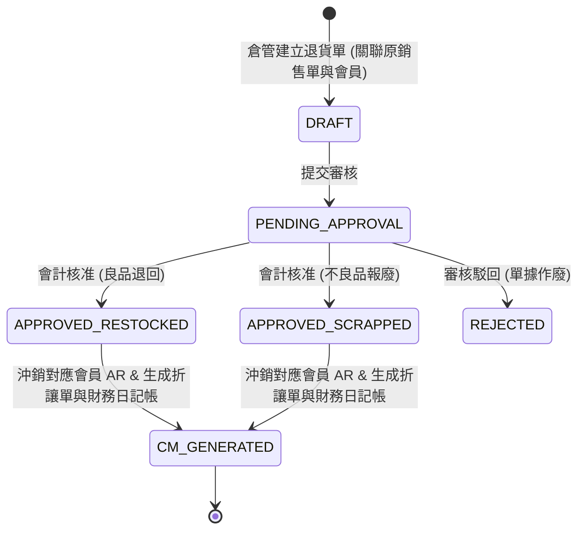
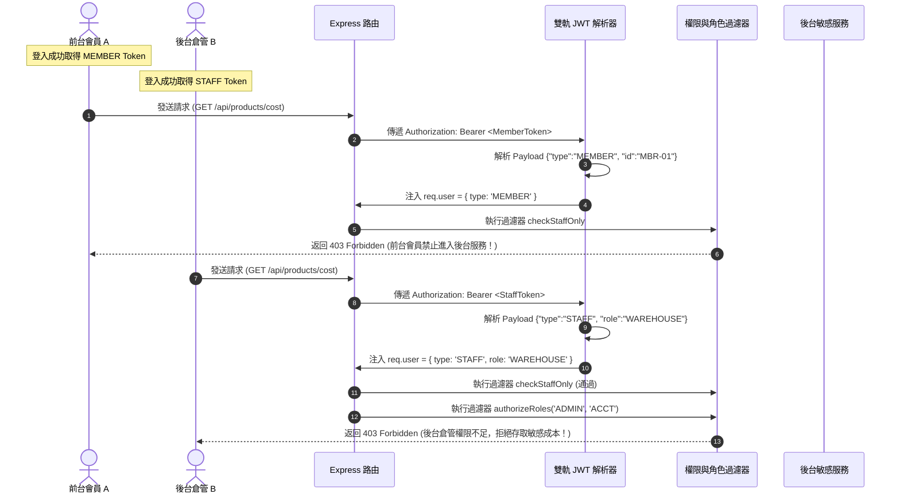

# 進銷存與權限管理系統 (Invoicing, Inventory & RBAC System) 業務規格書

---

## 一、 系統概述與業務價值 (System Overview & Business Value)

本系統是一套專為中小型批發商或電商企業設計的「進銷存與權限管理系統」。其核心價值在於解決以下痛點：
1.  **庫存不實與超賣**：多業務併發下搶購同商品導致庫存超賣、負數庫存。
2.  **越權安全漏洞**：一般員工可隨意查看商業敏感進貨成本，或前台會員企圖偽造 Token 存取後台 API。
3.  **無會員歸戶與對帳難題**：沒有獨立的「會員資料表與驗證機制」，導致消費無法歸戶、對帳困難、且無法提供會員專屬的前台歷史訂單查詢。
4.  **行銷與折扣自動化不足**：缺乏會員消費累計與自動升級折扣機制，結帳時需人工計算折扣，易出人為疏失。
5.  **財務與折讓追蹤混亂**：銷退發生時，實體報廢、庫存異動與「會員折讓單 (Credit Memo)」、「財務分錄 (Ledger)」無法自動關聯寫入，增加人工對帳成本。
6.  **稽核困難**：庫存與財務數據變更缺乏前後狀態日誌軌跡，難以追溯和審計。

---

## 二、 使用者故事 (User Stories)

### User Story 1 - 人員帳號管理與 Staff RBAC 權限
*   **身分**：系統管理員 (ADMIN)。
*   **需求**：我需要新增、停用、查詢員工的帳號，並為其分配單一的角色（ADMIN, ACCT, SALES, WAREHOUSE）。
*   **業務價值**：控制系統後台安全邊界，防止越權操作，落實專人專責。
*   **驗收場景 (Acceptance Scenarios)**：
    *   **場景一（密碼安全）**：新增員工時，密碼長度必須大於等於 8 碼，包含大寫字母、小寫字母與數字。不符時系統應返回 `ERR_PASSWORD_WEAK` 錯誤。
    *   **場景二（帳號唯一性）**：建立已存在的帳號時，系統必須返回 `ERR_USER_EXISTS`。
    *   **場景三（權限越權攔截）**：當 SALES 角色嘗試存取 `GET /api/users` 或 `GET /api/audit-logs` 時，API 必須返回 `403 Forbidden`。

### User Story 2 - 商品主檔管理與安全庫存補貨預警
*   **身分**：倉管人員 (WAREHOUSE) 或系統管理員 (ADMIN)。
*   **需求**：我需要對商品主檔進行 CRUD 管理，並能為商品設定安全庫存水位。當庫存水位低於安全庫存時，儀表板必須即時顯示警示。
*   **業務價值**：保證商品基礎數據的精確性，條碼槍掃描速度，並提供主動補貨通知，防止缺貨失單。
*   **驗收場景 (Acceptance Scenarios)**：
    *   **場景一（重複條碼防禦）**：新增或修改商品時，若國際條碼與已有商品重複，系統應回退交易並提示 `ERR_BARCODE_EXISTS`。
    *   **場景二（自動補貨預警）**：
        *   **Given** 商品 A 的現有庫存為 50，安全庫存為 100；
        *   **When** 倉管人員進入儀表板；
        *   **Then** 系統必須在警示區顯示「商品 A 已低於安全水位，建議補貨 50 件（現有: 50, 安全水位: 100）」。

### User Story 3 - 銷售單審核出貨與自動扣減庫存 (主副表原子交易且綁定會員)
*   **身分**：銷售主管 (ADMIN) 或系統管理員。
*   **需求**：我需要審核銷售單。審核通過時，系統必須在一個資料庫交易內扣減庫存、變更訂單狀態（銷售單必須與有效會員 ID 強關聯），並將變更記錄到稽核日誌。
*   **業務價值**：這是進銷存的核心交易，必須保證單據明細的總計、庫存扣減以及「會員應收帳款」絕對一致，防止帳面與實體數據分叉。
*   **驗收場景 (Acceptance Scenarios)**：
    *   **場景一（成功扣庫原子性與會員歸戶）**：
        *   **Given** 銷售單包含商品 A (數量 2)；A 庫存 10；該單關聯有效會員 `MBR-01`；
        *   **When** 主管審核通過該單；
        *   **Then** 商品 A 庫存精準變為 8，該銷售單狀態變更為 `APPROVED`，並將此交易計入會員 `MBR-01` 的消費總額，寫入一筆 `audit_logs`。
    *   **場景二（無效會員阻斷）**：
        *   **Given** 銷售單傳入了不存在的會員 ID `MBR-999`；
        *   **When** 嘗試建立或審核該銷售單；
        *   **Then** 整個 Transaction 必須自動回滾，返回 `ERR_MEMBER_NOT_FOUND`。

### User Story 4 - 銷售退貨與良品/不良品分類處置 (包含會員退折與應收沖銷)
*   **身分**：倉管人員 (WAREHOUSE) 與會計財務 (ACCT)。
*   **需求**：當客戶退貨時，倉管建立銷售退貨單（關聯原銷售單與對應會員），並將明細中的退回品項區分為「良品 (Restocked)」或「不良品/報廢 (Scrapped)」，由會計進行審核。
*   **業務價值**：正確分流瑕疵品與可銷售品，防止瑕疵商品重新流入出貨庫存，造成客訴；同時精準沖銷對應會員的應收帳款，提供對帳。
*   **驗收場景 (Acceptance Scenarios)**：
    *   **場景一（退貨數量超限攔截）**：
        *   **Given** 原銷售單中商品 A 已出貨 5 件，之前已退過 2 件；
        *   **When** 業務再次建立該單商品 A 的退貨單，數量輸入 4 件；
        *   **Then** 系統拒絕建立，提示 `ERR_RETURN_QTY_EXCEEDED (退貨數量 4 大於剩餘可退數量 3)`。
    *   **場景二（良品入庫財務流）**：
        *   **When** 會計審核良品退貨單（數量 2）；
        *   **Then** 商品可用庫存自動加 2，沖銷關聯會員的應收帳款，生成對應金額的折讓單 (Credit Memo)，會計科目自動認列銷貨退回與實體庫存回升。
    *   **場景三（不良品報廢財務流）**：
        *   **When** 會計審核不良品退貨單（數量 2）；
        *   **Then** 商品可用庫存**保持不變**，損壞商品移入「報廢庫存表」，同時沖銷關聯會員的應收帳款，生成折讓單，會計科目除認列銷退外，需借記「商品報廢損失」，貸記「商品存貨」以銷除庫存財產。

### User Story 5 - 高併發防超賣鎖定交易防線
*   **身分**：企業營運主管。
*   **需求**：當多個業務同時點擊審核出貨，爭奪僅存的商品時，系統必須排隊處理，防範負數庫存。
*   **驗收場景 (Acceptance Scenarios)**：
    *   **場景一（併發搶購）**：商品 C 僅剩 1 件。兩位業務在同一毫秒點擊審核出貨兩張包含商品 C (數量 1) 的銷售單。最終必須只有一張單審核成功（狀態 `APPROVED`，C 庫存變 0），另一張單被退回且拋出 `ERR_STOCK_INSUFFICIENT` 錯誤，庫存不能變為 -1。

### User Story 6 - 前台會員註冊、登入與雙軌驗證機制 (全新功能)
*   **身分**：企業會員/前台客戶 (Member)。
*   **需求**：我需要能在大廳前台進行註冊、使用 Email 或手機號碼登入，並能安全地檢索且查詢我個人的歷史銷售訂單與退貨單。
*   **業務價值**：提供客戶自定義前台門戶，減少客服人力成本，並通過雙軌 JWT 驗證，防止前台會員越權存取後台員工管理 API。
*   **驗收場景 (Acceptance Scenarios)**：
    *   **場景一（註冊格式驗證）**：註冊時，Email 必須符合國際 RFC 5322 標準格式，手機號碼必須符合 `^09\d{8}$` 台灣手機標準格式。不合規拒絕註冊並回傳 `ERR_INVALID_MEMBER_INFO`。
    *   **場景二（雙軌 JWT 防護）**：會員登入成功後，簽發包含 `"type": "MEMBER"` 的 Token。當會員嘗試使用此 Token 發送請求至 `/api/users` 或後台商品成本 API `/api/products/cost` 時，後端必須返回 `403 Forbidden`，確保前後台驗證機制徹底隔離。
    *   **場景三（個人訂單安全歸戶限制）**：當會員 A 登入後，嘗試查詢 `/api/my-orders?id=SO-B` (該單屬於會員 B) 時，系統必須返回 `403 Forbidden`，僅能查詢屬於自己 `member_id` 的訂單。

### User Story 7 - 會員消費累計與會員階級自動升級機制 (全新功能)
*   **身分**：企業行銷主管 / 系統自動化服務。
*   **需求**：系統必須自動追蹤會員的「累計消費金額（`total_spent`）」，並在銷售單「審核通過（`APPROVED`）」或退貨單「審核通過（`APPROVED`）」時，動態增減累計消費。當消費金額跨越門檻時，系統應自動將會員升級（Bronze -> Silver -> Gold -> Platinum），並在後續銷售結帳時，依其最新階級自動代出對應折扣比例，直接計算優惠。
*   **業務價值**：提升客戶回購意願，實現精準折扣自動化，防範人工手動計算折扣可能產生的舞弊與錯誤。
*   **驗收場景 (Acceptance Scenarios)**：
    *   **場景一（自動升級）**：
        *   **Given** 會員 A 當前累計消費為 $9,500（`BRONZE`）；
        *   **When** 財務審核通過該會員一筆實售 $1,000 的銷售單；
        *   **Then** 會員 A 累計消費變更為 $10,500，且其會員等級 `tier` 自動被更新為 `SILVER`，並寫入 `audit_logs` 稽核日誌。
    *   **場景二（銷退自動降級或扣減累計）**：
        *   **Given** 會員 A 當前累計消費為 $10,500（`SILVER`）；
        *   **When** 財務審核通過該會員一筆退款 $1,000 的退貨單；
        *   **Then** 會員 A 累計消費變更為 $9,500，且其會員等級 `tier` 自動被降級為 `BRONZE`，防止客戶惡意大量退貨套利。
    *   **場景三（結帳折扣自動帶出）**：
        *   **Given** 會員等級折扣規定（BRONZE 0%, SILVER 5%, GOLD 10%, PLATINUM 15%）；
        *   **When** 業務人員為 `SILVER` 會員建立銷售單並添加單價 $100 的商品；
        *   **Then** 系統自動帶入該商品折扣 5%，結帳單價變為 $95，明細小計為 $95，完全自動計算。

---

## 三、 欄位級業務校驗規則 (Field-Level Validation Rules)

### 領域異常到 HTTP 狀態碼之自動對映關係 (Domain Exceptions to HTTP Status Codes)
為確保系統具備高度語意化的 RESTful 協定一致性，所有寫入操作所拋出的領域異常均由全域錯誤中介軟體進行自動對映：
*   **404 Not Found** (`NotFoundException`)：請求實體或關聯對象不存在時拋出（如 `ERR_ORDER_NOT_FOUND` / `ERR_MEMBER_NOT_FOUND`）。
*   **403 Forbidden** (`UnauthorizedException`)：請求權限不足或狀態不符被阻斷時拋出（如 `ERR_MEMBER_SUSPENDED` / `ERR_ACCESS_DENIED`）。
*   **422 Unprocessable Entity** (`BusinessRuleException`)：輸入資料完整但違反核心業務 invariants 時拋出（如 `ERR_STOCK_INSUFFICIENT` / `ERR_RETURN_QTY_EXCEEDED` / `ERR_PASSWORD_WEAK`）。
*   **500 Internal Server Error**：非業務層面的底層系統故障（如資料庫連線中斷、連線池耗盡）。

### 欄位校驗明細表

所有資料寫入前，應用程式必須進行嚴格的格式與數值範圍校驗：

| 實體模組 | 欄位名稱 | 資料型態 | 必要性 | 校驗規則與邊界限制 | 失敗回傳代碼 |
| :--- | :--- | :--- | :---: | :--- | :--- |
| **會員** | `member_id` | String | 🟢 | 格式為 `MBR-YYYYMMDD-XXXX`，如 `MBR-20260522-0001` | `ERR_INVALID_MBR_ID` |
| **會員** | `email` | String | 🟢 | 符合標準 Email 格式，且在 `members` 表中具有唯一性 | `ERR_EMAIL_EXISTS` / `ERR_INVALID_EMAIL` |
| **會員** | `phone` | String | 🟢 | 符合台灣手機格式 `^09\d{8}$`，且在表中唯一 | `ERR_PHONE_EXISTS` / `ERR_INVALID_PHONE` |
| **會員** | `password` | String | 🟢 | 剛性強度：長度 >= 8 碼，必須同時包含大寫字母、小寫字母與數字。儲存為 bcrypt 雜湊 | `ERR_PASSWORD_WEAK` |
| **員工** | `password` | String | 🟢 | 剛性強度：長度 >= 8 碼，必須同時包含大寫字母、小寫字母與數字。儲存為 bcrypt 雜湊 | `ERR_PASSWORD_WEAK` |
| **員工** | `username` | String | 🟢 | 帳號唯一性：在後台 `users` 中唯一，重複時必須返回正確錯誤代碼 | `ERR_USER_EXISTS` |
| **會員** | `total_spent`| Decimal| 🟢 | 必須大於等於零，支援小數點後 2 位，預設為 0.00 | `ERR_TOTAL_SPENT_NEGATIVE` |
| **會員** | `tier` | String | 🟢 | 只能是 `BRONZE`, `SILVER`, `GOLD`, `PLATINUM` 之一 | `ERR_INVALID_MEMBER_TIER` |
| **商品** | `product_id` | String | 🟢 | 長度 3~20 碼，僅能包含大寫英數字與連字號，如 `PROD-A01` | `ERR_INVALID_PROD_ID` |
| **商品** | `barcode` | String | 🟢 | 剛性格式：僅限純數字，長度必須為精準 8 碼 (EAN-8) 或 13 碼 (EAN-13) | `ERR_INVALID_BARCODE` |
| **商品** | `product_id` | String | 🟢 | 長度 3~20 碼，僅能包含大寫英數字與連字號，如 `PROD-A01` | `ERR_INVALID_PROD_ID` |
| **商品** | `cost_price` | Decimal| 🟢 | 必須大於等於零，支援小數點後 2 位 | `ERR_PRICE_NEGATIVE` |
| **商品** | `retail_price`| Decimal| 🟢 | 必須大於等於 `cost_price` (零售價不得低於進貨成本) | `ERR_RETAIL_LOW_THAN_COST`|
| **商品** | `stock_quantity`|Decimal| 🟢 | 必須大於等於零，預設值為 0。資料庫 CHECK 約束防線 | `ERR_STOCK_NEGATIVE` |
| **銷售明細** | `quantity` | Decimal| 🟢 | 必須大於零。嚴禁輸入 0 或負數數量 | `ERR_QTY_MUST_BE_POSITIVE`|
| **銷退明細** | `quantity` | Decimal| 🟢 | 必須大於零，且加上該單歷史退貨數不得超過原出貨數量 | `ERR_RETURN_QTY_EXCEEDED` |
| **折讓單** | `memo_id` | String | 🟢 | 格式為 `CM-YYYYMMDD-XXXX`，如 `CM-20260522-0001` | `ERR_INVALID_CM_ID` |
| **折讓單** | `memo_amount`|Decimal| 🟢 | 必須大於等於零，支援小數點後 2 位 | `ERR_CM_AMOUNT_NEGATIVE` |
| **財務日記帳**| `debit_amount`|Decimal| 🟢 | 必須大於等於零，支援小數點後 2 位，預設為 0.00 | `ERR_DEBIT_NEGATIVE` |
| **財務日記帳**| `credit_amount`|Decimal| 🟢 | 必須大於等於零，支援小數點後 2 位，預設為 0.00 | `ERR_CREDIT_NEGATIVE` |

---

## 四、 會員銷退與財務沖銷流向 (Return Disposal & Financial Flow)

退貨是進銷存中最複雜的例外流程。系統必須精準處理「實體庫存流」與「財務會計與會員沖銷流」的聯動：

### 良品與不良品處置流向詳細對照表：

| 項目類型 | 實體庫存異動 | 會員應收帳款 (AR) | 會計分錄 (Double-Entry Bookkeeping) | 折讓單 (Credit Memo) |
| :--- | :--- | :--- | :--- | :--- |
| **良品退回** `is_restocked = true` | 商品主庫存 `products.stock_quantity` 自動增加退回數量。 可用庫存即時回升。 | 客戶之應收帳款餘額扣減： `total = return_qty * unit_price` (含稅)。 | 1. 借：銷貨退回與折讓 (Sales Return) &nbsp;&nbsp;&nbsp;&nbsp;貸：應收帳款 (AR) 2. 借：商品存貨 (Inventory) (進貨成本) &nbsp;&nbsp;&nbsp;&nbsp;貸：銷貨成本 (COGS) | 自動生成 `credit_memos`。 對應歸戶會員名下。 狀態標記為「未套用折抵 (UNAPPLIED)」，扣抵後更新為「已套用沖銷 (APPLIED)」。 |
| **不良品/報廢** `is_restocked = false` | 商品主庫存**不變**。 損壞商品數量寫入 `damaged_inventories` 報廢品表，移入廢品 virtual 倉。 | 客戶之應收帳款餘額扣減： `total = return_qty * unit_price` (含稅)。 | 1. 借：銷貨退回與折讓 (Sales Return) &nbsp;&nbsp;&nbsp;&nbsp;貸：應收帳款 (AR) 2. 借：商品報廢損失 (Scrappage Loss) (進貨成本) &nbsp;&nbsp;&nbsp;&nbsp;貸：商品存貨 (Inventory) | 自動生成 `credit_memos`。 對應歸戶會員名下。 狀態標記為「報廢已核認 (SCRAPPED)」。 |

---

## 四.五、 世界級高併發金融級防禦規範 (World-Class Concurrency & Financial Safety Invariants)

為使系統在極端並發、極端網路抖動與法規安全審計要求下達到 100% 強健性，本系統剛性實施以下三大金融級防線：

### 1. 全域剛性資源鎖定順序防線 (Rigid Global Lock Ordering)
*   **問題背景**：商品鎖定雖已字典排序，但若跨表（Member 與 Product）的鎖定順序不一致，依然會在極端高頻下觸發跨表死鎖，造成資料庫連線池枯竭與連線爆滿。
*   **剛性防禦**：全系統任何跨表 Mutation 交易中，其悲觀排他鎖 (`FOR UPDATE`) 的資源取得順序必須嚴格遵循：**`members` $\rightarrow$ `products` (依 ID 字典序) $\rightarrow$ `sales_orders` / `sales_returns`**。以此在數學上 100% 徹底打破死鎖環路條件，達成 0% 跨表死鎖率。

### 2. 事務型發件箱模式防線 (Transactional Outbox Pattern)
*   **問題背景**：在資料庫交易 commit 後才進行記憶體事件派發，若進程在 commit 與 dispatch 的極微小時間差內宕機或斷電，會導致等級變更、複式記帳等 post-commit 事件永久性丟失，引發重大財務不一致。
*   **剛性防禦**：所有核心領域事件不再採用記憶體派發，而是在同一個資料庫交易中，將領域事件原子性地寫入 `outbox_events` 發件箱資料表中 commit 保存。隨後由背景 worker 輪詢分發，保證事件 At-Least-Once (至少一次) 必定送達，徹底杜絕進程崩潰導致的數據不平。

### 3. 剛性冪等鍵防線 (Idempotency Key Guard)
*   **問題背景**：網路抖動或用戶重複快速點擊，會導致同一個「審核訂單」或「退貨核准」POST 請求重複送達。若高併發下兩次請求同時進入不同伺服器節點，會導致庫存重複扣減與財務重複認列。
*   **剛性防禦**：後端寫入型端點一律採用剛性冪等鍵校驗，在 Redis 執行原子性 SET NX 佔位。處理中的重複請求一律 100% 直接阻斷並回傳 `ERR_DUPLICATE_REQUEST` 錯誤，保證任何請求在極端並發下 **只會且精準被執行一次**！

---

## 五、 雙軌 JWT 驗證與後台 RBAC 安全防禦時序圖 (Dual-Track JWT & Security)

### 2. 後台人員角色權限對照表 (Staff RBAC Permission Matrix)

本系統建立嚴密的角色與權限邊界。未經授權的請求必須在 API 路由的最前端被中介軟體 (Middleware) 阻斷。以下為生產級全域人員權限對照表：

| 功能模組 (Module) | 路由端點 (API Endpoint) | 請求方法 | ADMIN (管理員) | ACCT (會計財務) | SALES (銷售業務) | WAREHOUSE (倉管人員) | 業務意義與權限限制說明 |
| :--- | :--- | :---: | :---: | :---: | :---: | :---: | :--- |
| **員工管理** | `/api/users` | GET | 🟢 | ❌ | ❌ | ❌ | 查詢後台員工帳號列表（僅限系統管理員） |
| **員工管理** | `/api/users` | POST | 🟢 | ❌ | ❌ | ❌ | 註冊新增後台員工帳號（僅限系統管理員） |
| **員工管理** | `/api/users/:id` | PUT/DELETE| 🟢 | ❌ | ❌ | ❌ | 啟用/停用/修改員工帳號（僅限系統管理員） |
| **商品管理** | `/api/products` | GET | 🟢 | 🟢 | 🟢 | 🟢 | 查詢商品主檔列表（所有後台角色皆可） |
| **商品管理** | `/api/products/cost` | GET | 🟢 | 🟢 | ❌ | ❌ | **【敏感價格】** 讀取商品進貨成本 `cost_price`（嚴防銷售與倉管洩漏） |
| **商品管理** | `/api/products` | POST | 🟢 | ❌ | ❌ | 🟢 | 新增商品主檔（僅限管理員與倉管人員） |
| **商品管理** | `/api/products/:id` | PUT/DELETE| 🟢 | ❌ | ❌ | 🟢 | 修改/刪除商品主檔（僅限管理員與倉管人員） |
| **庫存預警** | `/api/products/low-stock` | GET | 🟢 | ❌ | ❌ | 🟢 | 查詢安全庫存補貨預警列表（僅限管理員與倉管） |
| **銷售管理** | `/api/sales-orders` | POST | 🟢 | ❌ | 🟢 | ❌ | 建立銷售訂單草稿單 (DRAFT)（僅限管理員與業務） |
| **銷售管理** | `/api/sales-orders` | GET | 🟢 | 🟢 | 🟢 | 🟢 | 查詢所有銷售訂單列表（所有後台人員皆可） |
| **銷售管理** | `/api/sales-orders/:id` | GET | 🟢 | 🟢 | 🟢 | 🟢 | 查詢單筆銷售訂單詳情（包含明細） |
| **銷售單審核**| `/api/sales-orders/:id/approve`| POST| 🟢 | ❌ | ❌ | ❌ | **【高權限】** 審核銷售單並執行悲觀鎖原子扣庫（僅限系統管理員） |
| **退貨管理** | `/api/sales-returns` | POST | 🟢 | ❌ | 🟢 | 🟢 | 建立退貨單草稿 (DRAFT)（僅限管理員、業務與倉管） |
| **退貨管理** | `/api/sales-returns` | GET | 🟢 | 🟢 | 🟢 | 🟢 | 查詢所有銷售退貨單列表（所有後台人員皆可） |
| **退貨單審核**| `/api/sales-returns/:id/approve`| POST| 🟢 | 🟢 | ❌ | ❌ | **【高權限】** 審核退貨單並執行良品回庫/不良品報廢（僅限管理員與會計） |
| **日誌審計** | `/api/audit-logs` | GET | 🟢 | 🟢 | ❌ | ❌ | 查詢系統操作稽核日誌（僅限管理員與會計） |
| **財務看板** | `/api/financial-ledgers`| GET | 🟢 | 🟢 | ❌ | ❌ | 查詢雙分錄複式日記帳（僅限管理員與會計） |

*備註：前台會員 (MEMBER) 僅能存取自註冊、自登入及自查個人歷史銷售訂單之特定路由（如 `/api/member/my-orders`），無權限存取上述任何後台 RESTful API，嘗試存取一律返回 `403 Forbidden`。*

本圖展現系統如何透過「前台會員 Token」與「後台員工 Token」的雙軌隔離機制，徹底防範前台會員試圖存取後台敏感 API 的安全漏洞：

---

### 3. 【資訊安全防禦政策】稽核日誌敏感資料去識別化 (Audit Log Sanitization)
為防範潛在的資安威脅，任何對資料庫的操作在寫入 `audit_logs` 之前，後端應用層必須對 `payload_before` 與 `payload_after` 進行**敏感欄位去識別化（Sanitization）**。
*   **禁止寫入**：包括 `password_hash`、`passwordHash`、二級金鑰等敏感欄位。
*   **去識別化方法**：任何包含此欄位的 JSON Payload，該欄位必須被替換為固定字串 `"********"` 或直接從 JSON 中剔除（Delete），防止有資料庫唯讀權限的財務或銷售人員透過稽核日誌逆向解密或進行密碼爆破。

---

## 六、 營業稅、折扣與訂單金額計算規則 (Tax & Amount Calculations)

本系統強制執行以下金額計算與四捨五入標準：
1. **加值型營業稅率**：固定為 **5% (0.05)**。
2. **單據含稅機制**：所有商品售價、明細小計與單據總額在資料庫中一律儲存「應稅含稅」金額。
3. **高精度 Money 計算防線**：為徹底防止 JavaScript 原生浮點數計算（如 `0.1 + 0.2`）所產生的微小精度誤差，**領域層一律以整數「分 (Cents)」作為金額值物件 (`Money`) 的儲存與運算單位**，只有在寫入資料庫及前端呈現層時，才將其轉換為兩位小數的 Decimal 類型。
4. **明細單價 (折後單價)**：
   $discounted_unit_price = unit_price * (1.00 - discount_rate)$
5. **折後毛利防護線**：折後單價 (`discounted_unit_price`) 必須大於等於進貨成本 (`cost_price`)，杜絕任何低於成本虧本銷售。
6. **單行明細小計 (`subtotal`)**：
   $subtotal = RoundHalfUp(quantity * discounted_unit_price, 2)$
6. **訂單總額 (`total_amount`)**：
   $total_amount = \sum subtotal$
7. **會計日記帳拆分**：
   - 銷售淨額 (`sales_net`) = $RoundHalfUp(total_amount / 1.05, 2)$
   - 銷項稅額 (`sales_tax`) = $total_amount - sales_net$

為了確保銷貨單（Sales Order）與退貨單（Sales Return）的金額在後端及資料庫計算中絕無毫釐之差，本專案強制規定以下計算標準：

1.  **加值型營業稅率**：依台灣標準，加值型營業稅率一律固定為 **5% (0.05)**。
2.  **單據含稅機制**：為了簡化業務報價與前端顯示，系統所有商品售價、明細小計與單據總額，在資料庫存檔時一律採用**「應稅含稅 (Tax-Inclusive)」**金額。
3.  **計算公式**：
    *   **會員折扣比例 (`discount_rate`)**：基於結帳當下該會員的 `tier` 自動帶出。
        *   `BRONZE`: `0.00`
        *   `SILVER`: `0.05`
        *   `GOLD`: `0.10`
        *   `PLATINUM`: `0.15`
    *   **明細單價 (折後單價)**：`discounted_unit_price = unit_price * (1.00 - discount_rate)`
    *   **單行明細小計 (`subtotal`)**：
        $$\text{subtotal} = \text{RoundHalfUp}(\text{quantity} \times \text{discounted\_unit\_price}, 2)$$
        *備註：計算結果四捨五入至小數點後第 2 位。資料庫 `sales_order_details` 的 `subtotal` 將以 CHECK 約束嚴格驗證此公式。*
    *   **訂單總額 (`total_amount`)**：
        $$\text{total\_amount} = \sum \text{subtotal}$$
4.  **財務拆分與會計稅額申報 (財務分錄使用)**：
    當財務審核通過訂單，需將含稅總額拆分為「銷售淨額」與「銷項稅額」計入會計日記帳：
    *   **銷售淨額 (未稅銷售收入 / `sales_net`)**：
        $$\text{sales\_net} = \text{RoundHalfUp}\left(\frac{\text{total\_amount}}{1.05}, 2\right)$$
    *   **銷項稅額 (營業稅金 / `sales_tax`)**：
        $$\text{sales\_tax} = \text{total\_amount} - \text{sales\_net}$$
    *   *例如：一筆含稅總額為 $100 元的訂單，銷售淨額為 $95.24 元，銷項稅額為 $4.76 元。*

---

## 七、 實體折讓單 (Credit Memo) 與會計日記簿記錄規範

當銷售退貨審核通過時，為追蹤退款並落實財務複式記帳，系統必須在一筆原子交易內自動產生以下實體記錄：

### 1. 實體折讓單 (Credit Memo) 生成機制
*   每一筆核准的銷退單（`sales_returns`）必須精準對應產生一筆折讓單記錄（`credit_memos`）。
*   折讓單編號（`memo_id`）格式為 `CM-YYYYMMDD-XXXX`。
*   折讓單金額（`memo_amount`）必須精準等於該次銷退單的退款總額（`refund_total`）。
*   折讓單狀態預設為 `PENDING`，當財務完成實體退款或抵扣下一次帳款後，可更新為 `APPLIED`。

### 2. 會計日記帳 (Double-Entry Ledger) 複式記帳分錄

#### 【會計科目防錯防護壁】剛性會計科目 (Chart of Accounts, COA) 規格

在任何會計與財務記錄中，本系統實施以下兩大剛性防護：
1. **科目剛性約束**：僅限存取預先定義的科目代碼，任何未定義的科目代碼一律拒絕寫入。
2. **借貸餘額剛性平衡約束 (Double-Entry Balance Invariant)**：每一筆日記帳交易中，其所有分錄的 **借方總金額 必須 精準等於 貸方總金額（借貸差額為 0.00 分錢）**。系統會在保存前透過領域服務 `BookkeepingService` 進行餘額平衡校驗，如果不相等則交易 100% 拒絕寫入並立刻回滾，防止資料庫產生錯帳。
為了避免人為輸入錯誤或工程師在代碼中拼寫錯誤（例如將 `INVENTORY` 拼寫為 `INVENTRY`）導致財務分錄崩潰，系統強制限制會計科目（`account_code`）必須嚴格限制為以下合法科目代碼之一，不合規時拒絕寫入日記帳：
*   `AR`：應收帳款 (Asset - Debit balance)
*   `SALES_REVENUE`：銷貨收入 (Revenue - Credit balance)
*   `SALES_TAX_PAYABLE`：應付代收稅額 / 營業稅 (Liability - Credit balance)
*   `COGS`：銷貨成本 (Expense - Debit balance)
*   `INVENTORY`：商品存貨 (Asset - Debit balance)
*   `SALES_RETURN`：銷貨退回與折讓 (Revenue Reduction - Debit balance)
*   `SCRAP_LOSS`：商品報廢損失 (Expense - Debit balance)
為了向會計師提供可稽核的財務軌跡，財務審核通過銷售單或退貨單時，系統必須向會計日記帳表（`financial_ledgers`）自動寫入對應的借貸分錄：

#### A. 銷售單審核通過 (Sales Order Approved)
*   **分錄一（應收帳款增加，含稅）**：
    *   借記：`ACCOUNTS_RECEIVABLE` (應收帳款)，金額 = `total_amount`
*   **分錄二（銷售收入認列，未稅）**：
    *   貸記：`SALES_REVENUE` (銷貨收入)，金額 = `sales_net`
*   **分錄三（應納營業稅認列，稅額）**：
    *   貸記：`SALES_TAX_PAYABLE` (應付營業稅/銷項稅額)，金額 = `sales_tax`
*   **分錄四（商品庫存扣減，成本）**：
    *   借記：`COGS` (銷貨成本)，金額 = `Sum(quantity * cost_price)`
    *   貸記：`INVENTORY` (商品存貨)，金額 = `Sum(quantity * cost_price)`

#### B. 退貨單審核通過 - 良品退回 (Sales Return Restocked Approved)
*   **分錄一（銷售退回認列，未稅）**：
    *   借記：`SALES_RETURN` (銷貨退回)，金額 = `refund_net` (未稅)
*   **分錄二（銷項稅額沖回，稅額）**：
    *   借記：`SALES_TAX_PAYABLE` (應付營業稅)，金額 = `refund_tax` (稅額)
*   **分錄三（會員應收帳款沖銷/退款，含稅）**：
    *   貸記：`ACCOUNTS_RECEIVABLE` (應收帳款/折讓)，金額 = `refund_total` (含稅)
*   **分錄四（良品庫存回升，成本）**：
    *   借記：`INVENTORY` (商品存貨)，金額 = `Sum(quantity * cost_price)`
    *   貸記：`COGS` (銷貨成本)，金額 = `Sum(quantity * cost_price)`

#### C. 退貨單審核通過 - 不良品報廢 (Sales Return Scrapped Approved)
*   *實體可用庫存不回升，故庫存科目不記入商品存貨，而是直接轉列報廢損失：*
*   **分錄一至三分錄同良品退回**（認列銷退、沖回稅額、沖銷應收帳款）。
*   **分錄四（報廢損失認列，成本）**：
    *   借記：`SCRAP_LOSS` (商品報廢損失)，金額 = `Sum(quantity * cost_price)`
    *   貸記：`INVENTORY` (商品存貨) (直接自原存貨金額沖減銷除)，金額 = `Sum(quantity * cost_price)`

---

## 八、 驗證與成功指標 (Success Metrics)

*   **SC-001**：在 100 筆併發對撞下，超賣率必須為 **0%**，庫存不能為負數。
*   **SC-002**：非 ADMIN/ACCT 角色（包括所有會員以及非授權員工）嘗試讀取 `cost_price` 敏感 API 時，**100%** 被攔截並返回 `403 Forbidden`。
*   **SC-003**：前台會員查詢非本人的銷售單或退貨單時，**100%** 被阻斷並返回 `403 Forbidden`。
*   **SC-004**：所有寫入操作（INSERT, UPDATE, DELETE）必須 **100%** 自動觸發 `audit_logs` 寫入，遺漏率為 0%。
*   **SC-005**：會員消費累計與等級升降級判定正確率必須為 **100%**，且升級時必須正確觸發等級變更與稽核日誌。
*   **SC-006**：單據金額計算（營業稅拆分、折扣小計四捨五入）與會計借貸分錄借貸相符，出錯率為 **0%**。

---

## 九、 DDD 領域建模與戰略設計規範 (DDD Domain Modeling & Strategic Design)

為了因應未來業務的持續擴張，並確保各核心業務模組（進銷存、會員折扣、複式記帳）之高凝聚性與低耦合性，本系統在業務邏輯層面完全導入 **DDD 戰略設計**。以下為本系統之邊界上下文與領域建模規格：

### 1. 限界上下文 (Bounded Contexts) 劃分與職責

本系統劃分為以下六個限界上下文：

| 限界上下文 (Bounded Context) | 主要業務職責與範疇 | 核心領域概念 | 類型 |
| :--- | :--- | :--- | :--- |
| **IAM 上下文 (Identity & Access Context)** | 後台員工的身份驗證、權限控制（RBAC）與帳號管理。 | `User` (實體), `Role` (值物件) | 通用域 |
| **會員上下文 (Member Context)** | 前台會員註冊與登入、消費累計追蹤、會員階級自動升降級。 | `Member` (聚合根), `TierRule` (領域規則) | 核心域 |
| **商品與庫存上下文 (Product & Inventory)** | 商品主檔管理、安全庫存設定與自動補貨預警。 | `Product` (聚合根), `InventoryAlert` (領域服務) | 支撐域 |
| **銷售上下文 (Sales Context)** | 銷售單建立、明細折扣計算、主管審核與原子扣庫出貨。 | `SalesOrder` (聚合根), `SalesOrderDetail` (實體), `CheckoutService` (領域服務) | 核心域 |
| **退貨與折讓上下文 (Return Context)** | 良品/不良品退貨處置、會員應收沖銷、折讓單自動生成。 | `SalesReturn` (聚合根), `SalesReturnDetail` (實體), `CreditMemo` (實體) | 核心域 |
| **財務上下文 (Finance Context)** | 依據審核通過的銷售單與退貨單，自動認列複式記帳分錄。 | `FinancialLedger` (聚合根), `BookkeepingService` (領域服務) | 支撐域 |

---

### 2. 限界上下文對映關係 (Context Mapping)

本系統上下文之間的通訊關係如圖所示：

*   **Sales Context (銷售) & Return Context (退貨) $
ightarrow$ Member Context (會員)**：
    *   *關係*：客戶-供應商 (Customer-Supplier)。銷售與退貨上下文為下游 (Downstream)，在結帳時向下游傳遞會員最新的消費累計並取得其對應之折扣。
*   **Sales Context (銷售) $
ightarrow$ Product & Inventory Context (商品庫存)**：
    *   *關係*：共享核心 (Shared Kernel) 與客戶-供應商。銷售單審核時，必須透過庫存領域服務鎖定商品並安全扣減可用數量。
*   **Sales/Return Context $
ightarrow$ Finance Context (財務)**：
    *   *關係*：發布者-訂閱者 (Publisher-Subscriber)。當銷售單或退貨單被主管/會計「核准 (APPROVED)」時，會發布領域事件（`SalesOrderApprovedEvent` / `SalesReturnApprovedEvent`），由財務上下文訂閱並非同步或同步轉入會計分錄帳。
*   **各上下文 $
ightarrow$ IAM Context (安全邊界)**：
    *   *關係*：防腐層 (Anti-Corruption Layer)。各業務模組透過 IAM 注入的 `req.user` 上下文物件進行防禦性 RBAC 校驗，避免外部 API 直接穿透到領域層。

---

### 3. 核心聚合根 (Aggregates) 與領域不變性約束 (Business Invariants)

每個聚合代表一個高凝聚力的業務邊界，外部代碼只能透過其**聚合根 (Aggregate Root)** 修改聚合狀態。各聚合的核心不變性規則如下：

#### A. Member (會員聚合)
*   **聚合根**：`Member`
*   **內部成員**：無（純實體與值物件組成的單一聚合）
*   **業務不變性 (Invariants)**：
    *   會員的等級 `tier` 必須嚴格與 `total_spent` 的累計範圍保持一致：
        *   `BRONZE`: $0.00 \le 	ext{total\_spent} < 10,000.00$
        *   `SILVER`: $10,000.00 \le 	ext{total\_spent} < 50,000.00$
        *   `GOLD`: $50,000.00 \le 	ext{total\_spent} < 100,000.00$
        *   `PLATINUM`: $	ext{total\_spent} \ge 100,000.00$
    *   會員註冊時之 `email` 與 `phone` 必須符合格式校驗（台灣手機 `^09\d{8}# 進銷存與權限管理系統 (Invoicing, Inventory & RBAC System) 業務規格書

---

## 一、 系統概述與業務價值 (System Overview & Business Value)

本系統是一套專為中小型批發商或電商企業設計的「進銷存與權限管理系統」。其核心價值在於解決以下痛點：
1.  **庫存不實與超賣**：多業務併發下搶購同商品導致庫存超賣、負數庫存。
2.  **越權安全漏洞**：一般員工可隨意查看商業敏感進貨成本，或前台會員企圖偽造 Token 存取後台 API。
3.  **無會員歸戶與對帳難題**：沒有獨立的「會員資料表與驗證機制」，導致消費無法歸戶、對帳困難、且無法提供會員專屬的前台歷史訂單查詢。
4.  **行銷與折扣自動化不足**：缺乏會員消費累計與自動升級折扣機制，結帳時需人工計算折扣，易出人為疏失。
5.  **財務與折讓追蹤混亂**：銷退發生時，實體報廢、庫存異動與「會員折讓單 (Credit Memo)」、「財務分錄 (Ledger)」無法自動關聯寫入，增加人工對帳成本。
6.  **稽核困難**：庫存與財務數據變更缺乏前後狀態日誌軌跡，難以追溯和審計。

---

## 二、 使用者故事 (User Stories)

### User Story 1 - 人員帳號管理與 Staff RBAC 權限
*   **身分**：系統管理員 (ADMIN)。
*   **需求**：我需要新增、停用、查詢員工的帳號，並為其分配單一的角色（ADMIN, ACCT, SALES, WAREHOUSE）。
*   **業務價值**：控制系統後台安全邊界，防止越權操作，落實專人專責。
*   **驗收場景 (Acceptance Scenarios)**：
    *   **場景一（密碼安全）**：新增員工時，密碼長度必須大於等於 8 碼，包含大寫字母、小寫字母與數字。不符時系統應返回 `ERR_PASSWORD_WEAK` 錯誤。
    *   **場景二（帳號唯一性）**：建立已存在的帳號時，系統必須返回 `ERR_USER_EXISTS`。
    *   **場景三（權限越權攔截）**：當 SALES 角色嘗試存取 `GET /api/users` 或 `GET /api/audit-logs` 時，API 必須返回 `403 Forbidden`。

### User Story 2 - 商品主檔管理與安全庫存補貨預警
*   **身分**：倉管人員 (WAREHOUSE) 或系統管理員 (ADMIN)。
*   **需求**：我需要對商品主檔進行 CRUD 管理，並能為商品設定安全庫存水位。當庫存水位低於安全庫存時，儀表板必須即時顯示警示。
*   **業務價值**：保證商品基礎數據的精確性，條碼槍掃描速度，並提供主動補貨通知，防止缺貨失單。
*   **驗收場景 (Acceptance Scenarios)**：
    *   **場景一（重複條碼防禦）**：新增或修改商品時，若國際條碼與已有商品重複，系統應回退交易並提示 `ERR_BARCODE_EXISTS`。
    *   **場景二（自動補貨預警）**：
        *   **Given** 商品 A 的現有庫存為 50，安全庫存為 100；
        *   **When** 倉管人員進入儀表板；
        *   **Then** 系統必須在警示區顯示「商品 A 已低於安全水位，建議補貨 50 件（現有: 50, 安全水位: 100）」。

### User Story 3 - 銷售單審核出貨與自動扣減庫存 (主副表原子交易且綁定會員)
*   **身分**：銷售主管 (ADMIN) 或系統管理員。
*   **需求**：我需要審核銷售單。審核通過時，系統必須在一個資料庫交易內扣減庫存、變更訂單狀態（銷售單必須與有效會員 ID 強關聯），並將變更記錄到稽核日誌。
*   **業務價值**：這是進銷存的核心交易，必須保證單據明細的總計、庫存扣減以及「會員應收帳款」絕對一致，防止帳面與實體數據分叉。
*   **驗收場景 (Acceptance Scenarios)**：
    *   **場景一（成功扣庫原子性與會員歸戶）**：
        *   **Given** 銷售單包含商品 A (數量 2)；A 庫存 10；該單關聯有效會員 `MBR-01`；
        *   **When** 主管審核通過該單；
        *   **Then** 商品 A 庫存精準變為 8，該銷售單狀態變更為 `APPROVED`，並將此交易計入會員 `MBR-01` 的消費總額，寫入一筆 `audit_logs`。
    *   **場景二（無效會員阻斷）**：
        *   **Given** 銷售單傳入了不存在的會員 ID `MBR-999`；
        *   **When** 嘗試建立或審核該銷售單；
        *   **Then** 整個 Transaction 必須自動回滾，返回 `ERR_MEMBER_NOT_FOUND`。

### User Story 4 - 銷售退貨與良品/不良品分類處置 (包含會員退折與應收沖銷)
*   **身分**：倉管人員 (WAREHOUSE) 與會計財務 (ACCT)。
*   **需求**：當客戶退貨時，倉管建立銷售退貨單（關聯原銷售單與對應會員），並將明細中的退回品項區分為「良品 (Restocked)」或「不良品/報廢 (Scrapped)」，由會計進行審核。
*   **業務價值**：正確分流瑕疵品與可銷售品，防止瑕疵商品重新流入出貨庫存，造成客訴；同時精準沖銷對應會員的應收帳款，提供對帳。
*   **驗收場景 (Acceptance Scenarios)**：
    *   **場景一（退貨數量超限攔截）**：
        *   **Given** 原銷售單中商品 A 已出貨 5 件，之前已退過 2 件；
        *   **When** 業務再次建立該單商品 A 的退貨單，數量輸入 4 件；
        *   **Then** 系統拒絕建立，提示 `ERR_RETURN_QTY_EXCEEDED (退貨數量 4 大於剩餘可退數量 3)`。
    *   **場景二（良品入庫財務流）**：
        *   **When** 會計審核良品退貨單（數量 2）；
        *   **Then** 商品可用庫存自動加 2，沖銷關聯會員的應收帳款，生成對應金額的折讓單 (Credit Memo)，會計科目自動認列銷貨退回與實體庫存回升。
    *   **場景三（不良品報廢財務流）**：
        *   **When** 會計審核不良品退貨單（數量 2）；
        *   **Then** 商品可用庫存**保持不變**，損壞商品移入「報廢庫存表」，同時沖銷關聯會員的應收帳款，生成折讓單，會計科目除認列銷退外，需借記「商品報廢損失」，貸記「商品存貨」以銷除庫存財產。

### User Story 5 - 高併發防超賣鎖定交易防線
*   **身分**：企業營運主管。
*   **需求**：當多個業務同時點擊審核出貨，爭奪僅存的商品時，系統必須排隊處理，防範負數庫存。
*   **驗收場景 (Acceptance Scenarios)**：
    *   **場景一（併發搶購）**：商品 C 僅剩 1 件。兩位業務在同一毫秒點擊審核出貨兩張包含商品 C (數量 1) 的銷售單。最終必須只有一張單審核成功（狀態 `APPROVED`，C 庫存變 0），另一張單被退回且拋出 `ERR_STOCK_INSUFFICIENT` 錯誤，庫存不能變為 -1。

### User Story 6 - 前台會員註冊、登入與雙軌驗證機制 (全新功能)
*   **身分**：企業會員/前台客戶 (Member)。
*   **需求**：我需要能在大廳前台進行註冊、使用 Email 或手機號碼登入，並能安全地檢索且查詢我個人的歷史銷售訂單與退貨單。
*   **業務價值**：提供客戶自定義前台門戶，減少客服人力成本，並通過雙軌 JWT 驗證，防止前台會員越權存取後台員工管理 API。
*   **驗收場景 (Acceptance Scenarios)**：
    *   **場景一（註冊格式驗證）**：註冊時，Email 必須符合國際 RFC 5322 標準格式，手機號碼必須符合 `^09\d{8}$` 台灣手機標準格式。不合規拒絕註冊並回傳 `ERR_INVALID_MEMBER_INFO`。
    *   **場景二（雙軌 JWT 防護）**：會員登入成功後，簽發包含 `"type": "MEMBER"` 的 Token。當會員嘗試使用此 Token 發送請求至 `/api/users` 或後台商品成本 API `/api/products/cost` 時，後端必須返回 `403 Forbidden`，確保前後台驗證機制徹底隔離。
    *   **場景三（個人訂單安全歸戶限制）**：當會員 A 登入後，嘗試查詢 `/api/my-orders?id=SO-B` (該單屬於會員 B) 時，系統必須返回 `403 Forbidden`，僅能查詢屬於自己 `member_id` 的訂單。

### User Story 7 - 會員消費累計與會員階級自動升級機制 (全新功能)
*   **身分**：企業行銷主管 / 系統自動化服務。
*   **需求**：系統必須自動追蹤會員的「累計消費金額（`total_spent`）」，並在銷售單「審核通過（`APPROVED`）」或退貨單「審核通過（`APPROVED`）」時，動態增減累計消費。當消費金額跨越門檻時，系統應自動將會員升級（Bronze -> Silver -> Gold -> Platinum），並在後續銷售結帳時，依其最新階級自動代出對應折扣比例，直接計算優惠。
*   **業務價值**：提升客戶回購意願，實現精準折扣自動化，防範人工手動計算折扣可能產生的舞弊與錯誤。
*   **驗收場景 (Acceptance Scenarios)**：
    *   **場景一（自動升級）**：
        *   **Given** 會員 A 當前累計消費為 $9,500（`BRONZE`）；
        *   **When** 財務審核通過該會員一筆實售 $1,000 的銷售單；
        *   **Then** 會員 A 累計消費變更為 $10,500，且其會員等級 `tier` 自動被更新為 `SILVER`，並寫入 `audit_logs` 稽核日誌。
    *   **場景二（銷退自動降級或扣減累計）**：
        *   **Given** 會員 A 當前累計消費為 $10,500（`SILVER`）；
        *   **When** 財務審核通過該會員一筆退款 $1,000 的退貨單；
        *   **Then** 會員 A 累計消費變更為 $9,500，且其會員等級 `tier` 自動被降級為 `BRONZE`，防止客戶惡意大量退貨套利。
    *   **場景三（結帳折扣自動帶出）**：
        *   **Given** 會員等級折扣規定（BRONZE 0%, SILVER 5%, GOLD 10%, PLATINUM 15%）；
        *   **When** 業務人員為 `SILVER` 會員建立銷售單並添加單價 $100 的商品；
        *   **Then** 系統自動帶入該商品折扣 5%，結帳單價變為 $95，明細小計為 $95，完全自動計算。

---

## 三、 欄位級業務校驗規則 (Field-Level Validation Rules)

所有資料寫入前，應用程式必須進行嚴格的格式與數值範圍校驗：

| 實體模組 | 欄位名稱 | 資料型態 | 必要性 | 校驗規則與邊界限制 | 失敗回傳代碼 |
| :--- | :--- | :--- | :---: | :--- | :--- |
| **會員** | `member_id` | String | 🟢 | 格式為 `MBR-YYYYMMDD-XXXX`，如 `MBR-20260522-0001` | `ERR_INVALID_MBR_ID` |
| **會員** | `email` | String | 🟢 | 符合標準 Email 格式，且在 `members` 表中具有唯一性 | `ERR_EMAIL_EXISTS` / `ERR_INVALID_EMAIL` |
| **會員** | `phone` | String | 🟢 | 符合台灣手機格式 `^09\d{8}$`，且在表中唯一 | `ERR_PHONE_EXISTS` / `ERR_INVALID_PHONE` |
| **會員** | `password` | String | 🟢 | 剛性強度：長度 >= 8 碼，必須同時包含大寫字母、小寫字母與數字。儲存為 bcrypt 雜湊 | `ERR_PASSWORD_WEAK` |
| **員工** | `password` | String | 🟢 | 剛性強度：長度 >= 8 碼，必須同時包含大寫字母、小寫字母與數字。儲存為 bcrypt 雜湊 | `ERR_PASSWORD_WEAK` |
| **員工** | `username` | String | 🟢 | 帳號唯一性：在後台 `users` 中唯一，重複時必須返回正確錯誤代碼 | `ERR_USER_EXISTS` |
| **會員** | `total_spent`| Decimal| 🟢 | 必須大於等於零，支援小數點後 2 位，預設為 0.00 | `ERR_TOTAL_SPENT_NEGATIVE` |
| **會員** | `tier` | String | 🟢 | 只能是 `BRONZE`, `SILVER`, `GOLD`, `PLATINUM` 之一 | `ERR_INVALID_MEMBER_TIER` |
| **商品** | `product_id` | String | 🟢 | 長度 3~20 碼，僅能包含大寫英數字與連字號，如 `PROD-A01` | `ERR_INVALID_PROD_ID` |
| **商品** | `barcode` | String | 🟢 | 剛性格式：僅限純數字，長度必須為精準 8 碼 (EAN-8) 或 13 碼 (EAN-13) | `ERR_INVALID_BARCODE` |
| **商品** | `product_id` | String | 🟢 | 長度 3~20 碼，僅能包含大寫英數字與連字號，如 `PROD-A01` | `ERR_INVALID_PROD_ID` |
| **商品** | `cost_price` | Decimal| 🟢 | 必須大於等於零，支援小數點後 2 位 | `ERR_PRICE_NEGATIVE` |
| **商品** | `retail_price`| Decimal| 🟢 | 必須大於等於 `cost_price` (零售價不得低於進貨成本) | `ERR_RETAIL_LOW_THAN_COST`|
| **商品** | `stock_quantity`|Decimal| 🟢 | 必須大於等於零，預設值為 0。資料庫 CHECK 約束防線 | `ERR_STOCK_NEGATIVE` |
| **銷售明細** | `quantity` | Decimal| 🟢 | 必須大於零。嚴禁輸入 0 或負數數量 | `ERR_QTY_MUST_BE_POSITIVE`|
| **銷退明細** | `quantity` | Decimal| 🟢 | 必須大於零，且加上該單歷史退貨數不得超過原出貨數量 | `ERR_RETURN_QTY_EXCEEDED` |
| **折讓單** | `memo_id` | String | 🟢 | 格式為 `CM-YYYYMMDD-XXXX`，如 `CM-20260522-0001` | `ERR_INVALID_CM_ID` |
| **折讓單** | `memo_amount`|Decimal| 🟢 | 必須大於等於零，支援小數點後 2 位 | `ERR_CM_AMOUNT_NEGATIVE` |
| **財務日記帳**| `debit_amount`|Decimal| 🟢 | 必須大於等於零，支援小數點後 2 位，預設為 0.00 | `ERR_DEBIT_NEGATIVE` |
| **財務日記帳**| `credit_amount`|Decimal| 🟢 | 必須大於等於零，支援小數點後 2 位，預設為 0.00 | `ERR_CREDIT_NEGATIVE` |

---

## 四、 會員銷退與財務沖銷流向 (Return Disposal & Financial Flow)

退貨是進銷存中最複雜的例外流程。系統必須精準處理「實體庫存流」與「財務會計與會員沖銷流」的聯動：

### 良品與不良品處置流向詳細對照表：

| 項目類型 | 實體庫存異動 | 會員應收帳款 (AR) | 會計分錄 (Double-Entry Bookkeeping) | 折讓單 (Credit Memo) |
| :--- | :--- | :--- | :--- | :--- |
| **良品退回** `is_restocked = true` | 商品主庫存 `products.stock_quantity` 自動增加退回數量。 可用庫存即時回升。 | 客戶之應收帳款餘額扣減： `total = return_qty * unit_price` (含稅)。 | 1. 借：銷貨退回與折讓 (Sales Return) &nbsp;&nbsp;&nbsp;&nbsp;貸：應收帳款 (AR) 2. 借：商品存貨 (Inventory) (進貨成本) &nbsp;&nbsp;&nbsp;&nbsp;貸：銷貨成本 (COGS) | 自動生成 `credit_memos`。 對應歸戶會員名下。 狀態標記為「已入庫沖銷」。 |
| **不良品/報廢** `is_restocked = false` | 商品主庫存**不變**。 損壞商品數量寫入 `damaged_inventories` 報廢品表，移入廢品 virtual 倉。 | 客戶之應收帳款餘額扣減： `total = return_qty * unit_price` (含稅)。 | 1. 借：銷貨退回與折讓 (Sales Return) &nbsp;&nbsp;&nbsp;&nbsp;貸：應收帳款 (AR) 2. 借：商品報廢損失 (Scrappage Loss) (進貨成本) &nbsp;&nbsp;&nbsp;&nbsp;貸：商品存貨 (Inventory) | 自動生成 `credit_memos`。 對應歸戶會員名下。 狀態標記為「報廢折讓已核認」。 |

---

## 五、 雙軌 JWT 驗證與後台 RBAC 安全防禦時序圖 (Dual-Track JWT & Security)

### 2. 後台人員角色權限對照表 (Staff RBAC Permission Matrix)

本系統建立嚴密的角色與權限邊界。未經授權的請求必須在 API 路由的最前端被中介軟體 (Middleware) 阻斷。以下為生產級全域人員權限對照表：

| 功能模組 (Module) | 路由端點 (API Endpoint) | 請求方法 | ADMIN (管理員) | ACCT (會計財務) | SALES (銷售業務) | WAREHOUSE (倉管人員) | 業務意義與權限限制說明 |
| :--- | :--- | :---: | :---: | :---: | :---: | :---: | :--- |
| **員工管理** | `/api/users` | GET | 🟢 | ❌ | ❌ | ❌ | 查詢後台員工帳號列表（僅限系統管理員） |
| **員工管理** | `/api/users` | POST | 🟢 | ❌ | ❌ | ❌ | 註冊新增後台員工帳號（僅限系統管理員） |
| **員工管理** | `/api/users/:id` | PUT/DELETE| 🟢 | ❌ | ❌ | ❌ | 啟用/停用/修改員工帳號（僅限系統管理員） |
| **商品管理** | `/api/products` | GET | 🟢 | 🟢 | 🟢 | 🟢 | 查詢商品主檔列表（所有後台角色皆可） |
| **商品管理** | `/api/products/cost` | GET | 🟢 | 🟢 | ❌ | ❌ | **【敏感價格】** 讀取商品進貨成本 `cost_price`（嚴防銷售與倉管洩漏） |
| **商品管理** | `/api/products` | POST | 🟢 | ❌ | ❌ | 🟢 | 新增商品主檔（僅限管理員與倉管人員） |
| **商品管理** | `/api/products/:id` | PUT/DELETE| 🟢 | ❌ | ❌ | 🟢 | 修改/刪除商品主檔（僅限管理員與倉管人員） |
| **庫存預警** | `/api/products/low-stock` | GET | 🟢 | ❌ | ❌ | 🟢 | 查詢安全庫存補貨預警列表（僅限管理員與倉管） |
| **銷售管理** | `/api/sales-orders` | POST | 🟢 | ❌ | 🟢 | ❌ | 建立銷售訂單草稿單 (DRAFT)（僅限管理員與業務） |
| **銷售管理** | `/api/sales-orders` | GET | 🟢 | 🟢 | 🟢 | 🟢 | 查詢所有銷售訂單列表（所有後台人員皆可） |
| **銷售管理** | `/api/sales-orders/:id` | GET | 🟢 | 🟢 | 🟢 | 🟢 | 查詢單筆銷售訂單詳情（包含明細） |
| **銷售單審核**| `/api/sales-orders/:id/approve`| POST| 🟢 | ❌ | ❌ | ❌ | **【高權限】** 審核銷售單並執行悲觀鎖原子扣庫（僅限系統管理員） |
| **退貨管理** | `/api/sales-returns` | POST | 🟢 | ❌ | 🟢 | 🟢 | 建立退貨單草稿 (DRAFT)（僅限管理員、業務與倉管） |
| **退貨管理** | `/api/sales-returns` | GET | 🟢 | 🟢 | 🟢 | 🟢 | 查詢所有銷售退貨單列表（所有後台人員皆可） |
| **退貨單審核**| `/api/sales-returns/:id/approve`| POST| 🟢 | 🟢 | ❌ | ❌ | **【高權限】** 審核退貨單並執行良品回庫/不良品報廢（僅限管理員與會計） |
| **日誌審計** | `/api/audit-logs` | GET | 🟢 | 🟢 | ❌ | ❌ | 查詢系統操作稽核日誌（僅限管理員與會計） |
| **財務看板** | `/api/financial-ledgers`| GET | 🟢 | 🟢 | ❌ | ❌ | 查詢雙分錄複式日記帳（僅限管理員與會計） |

*備註：前台會員 (MEMBER) 僅能存取自註冊、自登入及自查個人歷史銷售訂單之特定路由（如 `/api/member/my-orders`），無權限存取上述任何後台 RESTful API，嘗試存取一律返回 `403 Forbidden`。*

本圖展現系統如何透過「前台會員 Token」與「後台員工 Token」的雙軌隔離機制，徹底防範前台會員試圖存取後台敏感 API 的安全漏洞：

---

### 3. 【資訊安全防禦政策】稽核日誌敏感資料去識別化 (Audit Log Sanitization)
為防範潛在的資安威脅，任何對資料庫的操作在寫入 `audit_logs` 之前，後端應用層必須對 `payload_before` 與 `payload_after` 進行**敏感欄位去識別化（Sanitization）**。
*   **禁止寫入**：包括 `password_hash`、`passwordHash`、二級金鑰等敏感欄位。
*   **去識別化方法**：任何包含此欄位的 JSON Payload，該欄位必須被替換為固定字串 `"********"` 或直接從 JSON 中剔除（Delete），防止有資料庫唯讀權限的財務或銷售人員透過稽核日誌逆向解密或進行密碼爆破。

---

## 六、 營業稅、折扣與訂單金額計算規則 (Tax & Amount Calculations)

為了確保銷貨單（Sales Order）與退貨單（Sales Return）的金額在後端及資料庫計算中絕無毫釐之差，本專案強制規定以下計算標準：

1.  **加值型營業稅率**：依台灣標準，加值型營業稅率一律固定為 **5% (0.05)**。
2.  **單據含稅機制**：為了簡化業務報價與前端顯示，系統所有商品售價、明細小計與單據總額，在資料庫存檔時一律採用**「應稅含稅 (Tax-Inclusive)」**金額。
3.  **計算公式**：
    *   **會員折扣比例 (`discount_rate`)**：基於結帳當下該會員的 `tier` 自動帶出。
        *   `BRONZE`: `0.00`
        *   `SILVER`: `0.05`
        *   `GOLD`: `0.10`
        *   `PLATINUM`: `0.15`
    *   **明細單價 (折後單價)**：`discounted_unit_price = unit_price * (1.00 - discount_rate)`
    *   **單行明細小計 (`subtotal`)**：
        $$\text{subtotal} = \text{RoundHalfUp}(\text{quantity} \times \text{discounted\_unit\_price}, 2)$$
        *備註：計算結果四捨五入至小數點後第 2 位。資料庫 `sales_order_details` 的 `subtotal` 將以 CHECK 約束嚴格驗證此公式。*
    *   **訂單總額 (`total_amount`)**：
        $$\text{total\_amount} = \sum \text{subtotal}$$
4.  **財務拆分與會計稅額申報 (財務分錄使用)**：
    當財務審核通過訂單，需將含稅總額拆分為「銷售淨額」與「銷項稅額」計入會計日記帳：
    *   **銷售淨額 (未稅銷售收入 / `sales_net`)**：
        $$\text{sales\_net} = \text{RoundHalfUp}\left(\frac{\text{total\_amount}}{1.05}, 2\right)$$
    *   **銷項稅額 (營業稅金 / `sales_tax`)**：
        $$\text{sales\_tax} = \text{total\_amount} - \text{sales\_net}$$
    *   *例如：一筆含稅總額為 $100 元的訂單，銷售淨額為 $95.24 元，銷項稅額為 $4.76 元。*

---

## 七、 實體折讓單 (Credit Memo) 與會計日記簿記錄規範

當銷售退貨審核通過時，為追蹤退款並落實財務複式記帳，系統必須在一筆原子交易內自動產生以下實體記錄：

### 1. 實體折讓單 (Credit Memo) 生成機制
*   每一筆核准的銷退單（`sales_returns`）必須精準對應產生一筆折讓單記錄（`credit_memos`）。
*   折讓單編號（`memo_id`）格式為 `CM-YYYYMMDD-XXXX`。
*   折讓單金額（`memo_amount`）必須精準等於該次銷退單的退款總額（`refund_total`）。
*   折讓單狀態預設為 `PENDING`，當財務完成實體退款或抵扣下一次帳款後，可更新為 `APPLIED`。

### 2. 會計日記帳 (Double-Entry Ledger) 複式記帳分錄

#### 【會計科目防錯防護壁】剛性會計科目 (Chart of Accounts, COA) 規格
為了避免人為輸入錯誤或工程師在代碼中拼寫錯誤（例如將 `INVENTORY` 拼寫為 `INVENTRY`）導致財務分錄崩潰，系統強制限制會計科目（`account_code`）必須嚴格限制為以下合法科目代碼之一，不合規時拒絕寫入日記帳：
*   `AR`：應收帳款 (Asset - Debit balance)
*   `SALES_REVENUE`：銷貨收入 (Revenue - Credit balance)
*   `SALES_TAX_PAYABLE`：應付代收稅額 / 營業稅 (Liability - Credit balance)
*   `COGS`：銷貨成本 (Expense - Debit balance)
*   `INVENTORY`：商品存貨 (Asset - Debit balance)
*   `SALES_RETURN`：銷貨退回與折讓 (Revenue Reduction - Debit balance)
*   `SCRAP_LOSS`：商品報廢損失 (Expense - Debit balance)
為了向會計師提供可稽核的財務軌跡，財務審核通過銷售單或退貨單時，系統必須向會計日記帳表（`financial_ledgers`）自動寫入對應的借貸分錄：

#### A. 銷售單審核通過 (Sales Order Approved)
*   **分錄一（應收帳款增加，含稅）**：
    *   借記：`ACCOUNTS_RECEIVABLE` (應收帳款)，金額 = `total_amount`
*   **分錄二（銷售收入認列，未稅）**：
    *   貸記：`SALES_REVENUE` (銷貨收入)，金額 = `sales_net`
*   **分錄三（應納營業稅認列，稅額）**：
    *   貸記：`SALES_TAX_PAYABLE` (應付營業稅/銷項稅額)，金額 = `sales_tax`
*   **分錄四（商品庫存扣減，成本）**：
    *   借記：`COGS` (銷貨成本)，金額 = `Sum(quantity * cost_price)`
    *   貸記：`INVENTORY` (商品存貨)，金額 = `Sum(quantity * cost_price)`

#### B. 退貨單審核通過 - 良品退回 (Sales Return Restocked Approved)
*   **分錄一（銷售退回認列，未稅）**：
    *   借記：`SALES_RETURN` (銷貨退回)，金額 = `refund_net` (未稅)
*   **分錄二（銷項稅額沖回，稅額）**：
    *   借記：`SALES_TAX_PAYABLE` (應付營業稅)，金額 = `refund_tax` (稅額)
*   **分錄三（會員應收帳款沖銷/退款，含稅）**：
    *   貸記：`ACCOUNTS_RECEIVABLE` (應收帳款/折讓)，金額 = `refund_total` (含稅)
*   **分錄四（良品庫存回升，成本）**：
    *   借記：`INVENTORY` (商品存貨)，金額 = `Sum(quantity * cost_price)`
    *   貸記：`COGS` (銷貨成本)，金額 = `Sum(quantity * cost_price)`

#### C. 退貨單審核通過 - 不良品報廢 (Sales Return Scrapped Approved)
*   *實體可用庫存不回升，故庫存科目不記入商品存貨，而是直接轉列報廢損失：*
*   **分錄一至三分錄同良品退回**（認列銷退、沖回稅額、沖銷應收帳款）。
*   **分錄四（報廢損失認列，成本）**：
    *   借記：`SCRAP_LOSS` (商品報廢損失)，金額 = `Sum(quantity * cost_price)`
    *   貸記：`INVENTORY` (商品存貨) (直接自原存貨金額沖減銷除)，金額 = `Sum(quantity * cost_price)`

---

## 八、 驗證與成功指標 (Success Metrics)

*   **SC-001**：在 100 筆併發對撞下，超賣率必須為 **0%**，庫存不能為負數。
*   **SC-002**：非 ADMIN/ACCT 角色（包括所有會員以及非授權員工）嘗試讀取 `cost_price` 敏感 API 時，**100%** 被攔截並返回 `403 Forbidden`。
*   **SC-003**：前台會員查詢非本人的銷售單或退貨單時，**100%** 被阻斷並返回 `403 Forbidden`。
*   **SC-004**：所有寫入操作（INSERT, UPDATE, DELETE）必須 **100%** 自動觸發 `audit_logs` 寫入，遺漏率為 0%。
*   **SC-005**：會員消費累計與等級升降級判定正確率必須為 **100%**，且升級時必須正確觸發等級變更與稽核日誌。
*   **SC-006**：單據金額計算（營業稅拆分、折扣小計四捨五入）與會計借貸分錄借貸相符，出錯率為 **0%**。

---

## 九、 DDD 領域建模與戰略設計規範 (DDD Domain Modeling & Strategic Design)

為了因應未來業務的持續擴張，並確保各核心業務模組（進銷存、會員折扣、複式記帳）之高凝聚性與低耦合性，本系統在業務邏輯層面完全導入 **DDD 戰略設計**。以下為本系統之邊界上下文與領域建模規格：

### 1. 限界上下文 (Bounded Contexts) 劃分與職責

本系統劃分為以下六個限界上下文：

| 限界上下文 (Bounded Context) | 主要業務職責與範疇 | 核心領域概念 | 類型 |
| :--- | :--- | :--- | :--- |
| **IAM 上下文 (Identity & Access Context)** | 後台員工的身份驗證、權限控制（RBAC）與帳號管理。 | `User` (實體), `Role` (值物件) | 通用域 |
| **會員上下文 (Member Context)** | 前台會員註冊與登入、消費累計追蹤、會員階級自動升降級。 | `Member` (聚合根), `TierRule` (領域規則) | 核心域 |
| **商品與庫存上下文 (Product & Inventory)** | 商品主檔管理、安全庫存設定與自動補貨預警。 | `Product` (聚合根), `InventoryAlert` (領域服務) | 支撐域 |
| **銷售上下文 (Sales Context)** | 銷售單建立、明細折扣計算、主管審核與原子扣庫出貨。 | `SalesOrder` (聚合根), `SalesOrderDetail` (實體), `CheckoutService` (領域服務) | 核心域 |
| **退貨與折讓上下文 (Return Context)** | 良品/不良品退貨處置、會員應收沖銷、折讓單自動生成。 | `SalesReturn` (聚合根), `SalesReturnDetail` (實體), `CreditMemo` (實體) | 核心域 |
| **財務上下文 (Finance Context)** | 依據審核通過的銷售單與退貨單，自動認列複式記帳分錄。 | `FinancialLedger` (聚合根), `BookkeepingService` (領域服務) | 支撐域 |

---

### 2. 限界上下文對映關係 (Context Mapping)

本系統上下文之間的通訊關係如圖所示：

*   **Sales Context (銷售) & Return Context (退貨) $
ightarrow$ Member Context (會員)**：
    *   *關係*：客戶-供應商 (Customer-Supplier)。銷售與退貨上下文為下游 (Downstream)，在結帳時向下游傳遞會員最新的消費累計並取得其對應之折扣。
*   **Sales Context (銷售) $
ightarrow$ Product & Inventory Context (商品庫存)**：
    *   *關係*：共享核心 (Shared Kernel) 與客戶-供應商。銷售單審核時，必須透過庫存領域服務鎖定商品並安全扣減可用數量。
*   **Sales/Return Context $
ightarrow$ Finance Context (財務)**：
    *   *關係*：發布者-訂閱者 (Publisher-Subscriber)。當銷售單或退貨單被主管/會計「核准 (APPROVED)」時，會發布領域事件（`SalesOrderApprovedEvent` / `SalesReturnApprovedEvent`），由財務上下文訂閱並非同步或同步轉入會計分錄帳。
*   **各上下文 $
ightarrow$ IAM Context (安全邊界)**：
    *   *關係*：防腐層 (Anti-Corruption Layer)。各業務模組透過 IAM 注入的 `req.user` 上下文物件進行防禦性 RBAC 校驗，避免外部 API 直接穿透到領域層。

---

### 3. 核心聚合根 (Aggregates) 與領域不變性約束 (Business Invariants)

每個聚合代表一個高凝聚力的業務邊界，外部代碼只能透過其**聚合根 (Aggregate Root)** 修改聚合狀態。各聚合的核心不變性規則如下：

#### A. Member (會員聚合)
*   **聚合根**：`Member`
*   **內部成員**：無（純實體與值物件組成的單一聚合）
*   **業務不變性 (Invariants)**：
    *   會員的等級 `tier` 必須嚴格與 `total_spent` 的累計範圍保持一致：
        *   `BRONZE`: $0.00 \le 	ext{total\_spent} < 10,000.00$
        *   `SILVER`: $10,000.00 \le 	ext{total\_spent} < 50,000.00$
        *   `GOLD`: $50,000.00 \le 	ext{total\_spent} < 100,000.00$
        *   `PLATINUM`: $	ext{total\_spent} \ge 100,000.00$
     且唯一），不合規則時拒絕更新。
    *   註：與商品條碼相隔離，會員實體中絕不包含 `barcode` (國際條碼) 概念，後者屬於獨立的商品上下文。

#### B. Product (商品與庫存聚合)
*   **聚合根**：`Product`
*   **內部成員**：無
*   **業務不變性 (Invariants)**：
    *   `retail_price` 必須隨時大於等於 `cost_price`（不得低於進貨成本虧本銷售）。
    *   **折後毛利剛性約束 (Discounted Margin Guard)**：在任何銷售單結帳時，商品的「折後實售單價 (`discounted_unit_price`)」絕對不可低於「進貨成本 (`cost_price`)」，系統強制在領域服務 `CheckoutService` 中進行此 Invariant 剛性防禦校驗，毛利率小於零時 100% 阻斷交易。
    *   `stock_quantity` 絕不允許為負數。多併發出貨時，若數量低於銷售需求，必須回滾交易。
    *   當 `stock_quantity` < `safety_stock` 時，自動觸發警報狀態。
    *   **安全水位領域事件聯動**：在扣減商品庫存時，若當前主庫存低於預設安全水位，聚合根 `Product` 會自動發布 `ProductLowStockAlert` 領域事件，由基礎設施層訂閱並非同步警報（例如自動寄送郵件給倉管），從而實現全自動預警。

#### C. SalesOrder (銷售訂單聚合)
*   **聚合根**：`SalesOrder`
*   **內部成員**：`SalesOrderDetail` (訂單明細實體)
*   **業務不變性 (Invariants)**：
    *   訂單一經審核通過 (`APPROVED`)，則狀態屬於**終態**，不可再做任何修改，僅能建立退貨單。
    *   明細項目的 `subtotal` 必須精準符合：
        $$\text{subtotal} = \text{RoundHalfUp}(\text{quantity} \times \text{discounted\_unit\_price}, 2)$$
    *   訂單總額 `total_amount` 必須嚴格等於所有 `subtotal` 之總和。

#### D. SalesReturn (退貨單聚合)
*   **聚合根**：`SalesReturn`
*   **內部成員**：`SalesReturnDetail` (退貨明細實體), `CreditMemo` (折讓單實體), `DamagedInventory` (報廢品實體)
*   **業務不變性 (Invariants)**：
    *   某項商品的退貨數量 `quantity` 加上該訂單歷史退貨數，絕對不可超過原銷售單的出貨數量。
    *   **高併發防重複退貨防線**：為防範多筆小額退貨在高併發下繞過上限，審核退貨單 (`SalesReturn`) 時，必須在交易中透過 `FOR UPDATE` 悲觀鎖排他性地鎖定原銷售訂單明細行 (`SalesOrderDetail`)，即時累加歷史已退貨總和進行剛性校驗，若超上限則 100% 拒絕並乾淨回滾。
    *   退款總額 `refund_total` 與生成的折讓單 `memo_amount` 必須與退貨明細折減金額完全吻合。
    *   當明細項標記為良品退回 (`is_restocked = true`)，必須關聯庫存增加；標記為報廢 (`is_restocked = false`)，必須寫入報廢表且主庫存維持不變。

---

**Version**: 1.4.0 (DDD Enabled) | **Ratified**: 2026-05-23 | **Last Amended**: 2026-05-23
